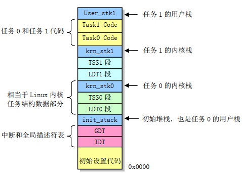
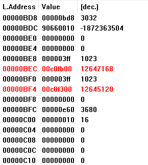
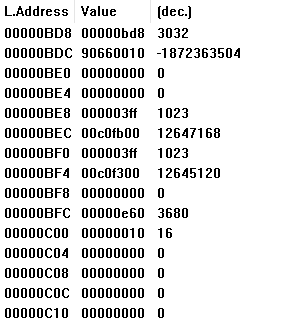
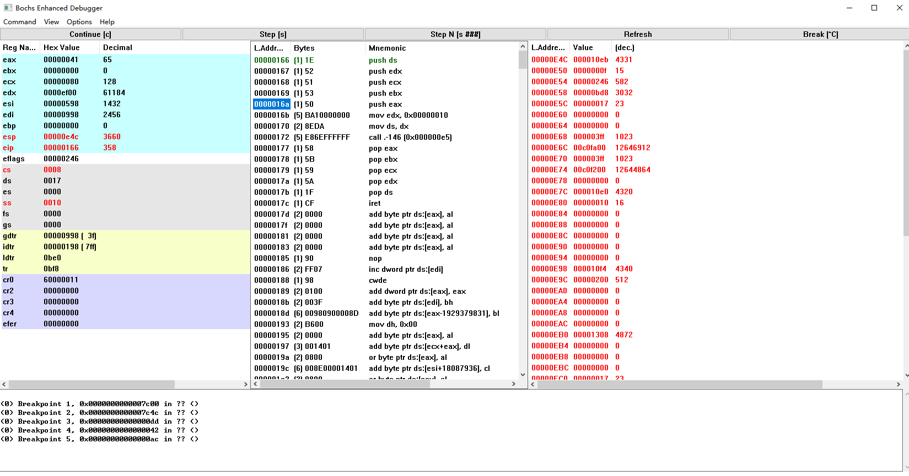

    19-lab01 report

# 1.请简述head.s的工作原理

* 首先加载DS、SS、ESP，此时所有段的线性基地址都是0
  * 加载数据段寄存器DS（存入0x10）和堆栈指针ESP（存入0x0bd8)
* 在新的位置重新设置IDT和GDT表
  * 跳转到setup_idt处设置IDT表，通过循环将所有256个中断门描述符都设置为同一个默认中断处理过程ignore_int，段描述符内容为0x 0000 8E00 0008 0114，表明该描述符是一个中断门，特权级为0，过程入口点偏移值为0x114，段选择子为0x08。
  * 通过段选择子“0x08”，可以到GDT中找到对应的中断门描述符，得到基地址0x0，再加上中断门描述符中的偏置量0x114，即可得到中断处理代码的入口地址。之后给IDTR赋值，前两个字节为表长度0x7ff，由于运行时的起始位置就是物理地址0x0处，所以线性基地址就是idt标签对应的值0x198。
  * 通过跳转到setup_gdt处设置GDT表，由于需要设置的GDT描述符较少，一共只有八个，所以可以直接写死在代码中不需要循环设置，直接加载GDTR即可。GDT的基地址为0x998，限长为0x3f。
* 之后重新加载所有段寄存器：将DS,ES,FS,GS,SS赋值为0x10；ESP赋值为0xbd8。
* 接下来设置8253定时芯片。把计数器通道0设置成每隔10ms向中断控制器发送一个中断请求信号。
* 然后在IDT表第8（0x8）和第128（0x80）项处分别设置定时中断门描述符和系统调用陷阱门描述符
  * 设置中断门描述符（由于位数的限制，edx中存放的是高32位，eax中存放的是低32位，后同）：
    
    给第8项赋值0x0000 8E00 0008 012A（含义：特权级为0，中断门描述符，段选择子为0x8，偏移为0x12a（即timer_interrupt程序入口地址））。将这些数存入寄存器后将他们加载到中断门的位置，找到位置放在esi中，将寄存器中的值赋进去，这样就完成了中断门描述符的设置。
  * 设置陷阱门描述符

    采用同样的方法，给第128项赋值0x0000 EF00 0080 0166（含义：特权级为3，陷阱门描述符，段选择子为0x80，偏移为0x166（即system_interrupt程序入口地址））。
* 接下来就是移动到任务0中执行来操作堆栈内容，在堆栈中人工建立中断返回时的场景：
  * 首先借助栈操作的过程复位标志寄存器EFLAGS中的嵌套任务标志NT，表示非嵌套任务；
  * 然后将TR任务寄存器赋值为任务0的TSS选择子0x20，再把任务0的LDT选择子0x28加载到LDTR中，变量current用来表示当前任务号；
  * 开中断，在栈中模拟中断返回时的场景，然后中断返回iret。
* 准备过程完成，开始执行任务0。

# 2.请记录 `head.s` 的内存分布状况，写明每个数据段，代码段，栈段的起始与终止的内存地址

head.s内存分布示意图如下：

各段的起始、终止地址如下表所示：
| 数据段           | 起始地址  | 终止地址  |
| ---------------- | -------- | -------- |
| current          | 0x17d    | 0x180    |
| idt              | 0x198    | 0x997    |
| gdt              | 0x998    | 0x9d7    |
| ldt0             | 0xbe0    | 0xc1f    |
| tss0             | 0xbf8    | 0xc5f    |
| ldt1             | 0xc60    | 0xe77    |
| tss1             | 0xe78    | 0xedf    |
| 代码段           |          |          |
| setup_idt        | 0xb5     | 0xe4     |
| setup_gdt        | 0xad     | 0xb4     |
| timer_interrupt  | 0x12a    | 0x165    |
| system_interrupt | 0x166    | 0x17c    |
| task0            | 0x10e0   | 0x10f3   |
| task1            | 0x10f4   | 0x1107   |
| 栈段             |          |          |
| init_stack       | 0x9d8    | 0xbd8    |
| krn_stk0         | 0xc60    | 0xe60    |
| krn_stk1         | 0xe00    | 0x10e0   |
| user_stk         | 0x1108   | 0x1308   |

# 3.简述 `head.s` `57` 到 `62` 行在做什么

这几行汇编程序根据中断处理返回时弹栈的规律，人工模拟了中断处理返回前栈中的场景。这样做是为了在中断处理返回后完成特权级从0到3的切换。

* 处理器把当前的栈选择符ss和栈指针esp压入新栈。
* 把标志寄存器eflags、代码段选择子cs和代码指针eip压入新栈。
* 由于此处人工模拟没有错误码的异常，因此省去了将错误码压入栈的过程。

# 4.简述 `iret` 执行后， `pc` 如何找到下一条指令

在iret执行之前已经人为地将即将使用的信息压在了栈中，创建了新的栈，iret后模拟从中断返回的过程，ss、esp、eflags、cs、eip这些寄存器都将赋予正确的值，以保证任务0正常执行。通过栈和寄存器的变化可以看出，栈中的task0开始地址0x10e0给到了eip，cs也从0x08变成了0x0f，即从内核模式切到了用户模式。pc根据弹出的cs查找ldt表，得到代码段基地址，然后加上偏移地址eip得到下一条指令的地址0x10e0。

# 5.记录iret执行前后，栈是如何变化的

iret执行前：

执行后：

# 6.当任务进行系统调用时，即 `int 0x80` 时，记录栈的变化情况

系统调用执行前：

执行后：

由上图可以看出，特权级发生了变化，cs由0x0f变成了0x08表明特权级由3变成了0，回到了了内核模式。