

    19-lab02 report

# 1. 当执行完 `system_interrupt` 函数，执行 `153` 行 `iret` 时，记录栈的变化情况

执行第 153 行 iret 之前各寄存器及栈的状态：

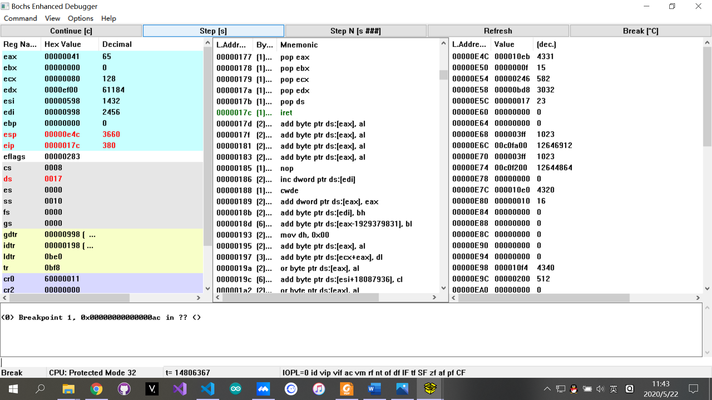

执行第 153 行 iret 之后各寄存器及栈的状态：

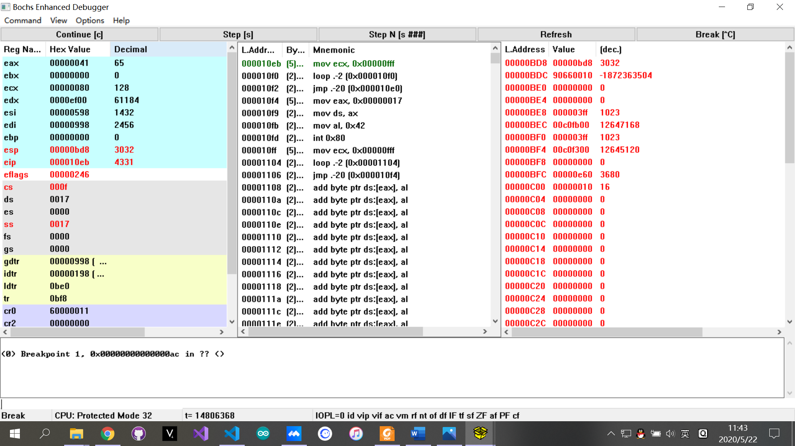

* 从上面第一张图可以看到，在执行iret指令前，以0xe60为栈底的任务0的内核栈中保存了任务0的堆栈寄存器ss、栈指针esp、标志寄存器eflags、代码段寄存器cs以及代码段指针eip的值。
* 从第二张图可以看出，在执行iret指令后，这些值被弹出，并赋给了相对应的寄存器，完成system_interrupt的执行过程，重新回到task0的代码中执行。
* 此时，使用的栈重新变为以0xbd8为栈底的task0的用户栈。

# 2. 当进入和退出 `system_interrupt` 时，都发生了模式切换，请总结模式切换时，特权级是如何改变的？栈切换吗？如何进行切换的？

## 2.1 进入system_interrupt时
进入 system_interrupt 之前各寄存器及栈的状态：

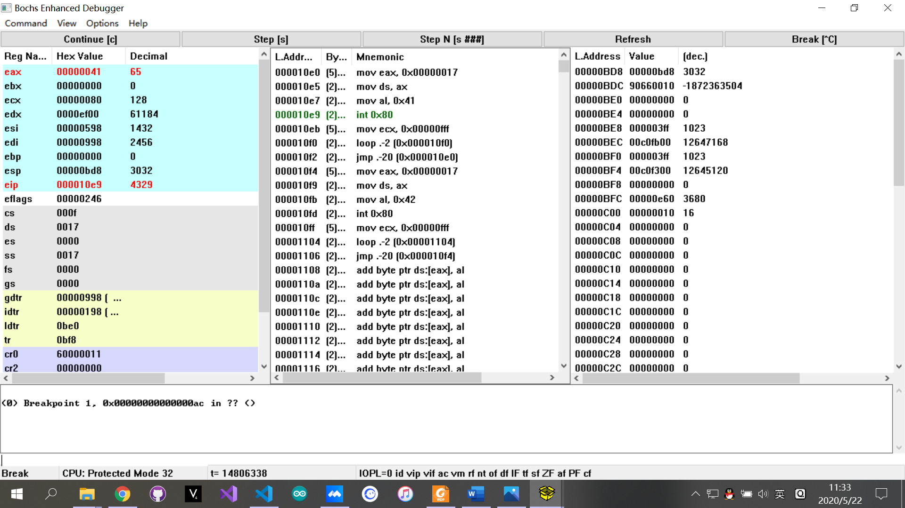

进入 system_interrupt 之后各寄存器及栈的状态：

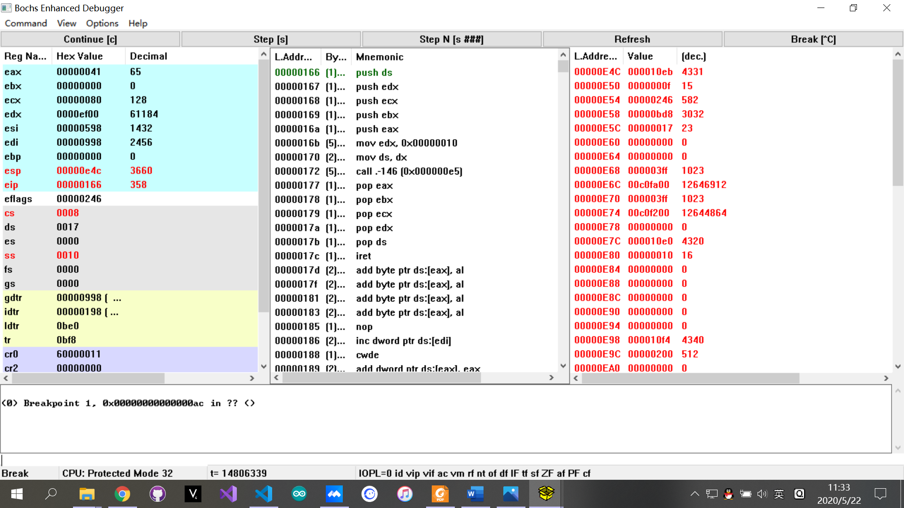

system_interrupt（int 0x80）对应的中断描述符如下图所示：

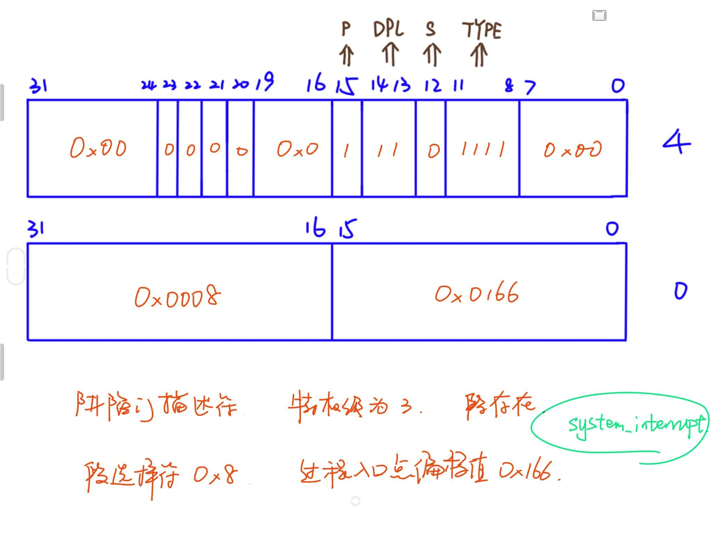

* 从上面三张图观察分析得出，当task0进入system_interrupt的时候，首先会通过中断相量号0x80在IDT表中得到对应的中断描述符表，该中断描述符表存放着system_interrupt中断代码的段选择符0x0008（低4字节的高16位）以及过程入口点的偏移值（低4字节的低16位）。
* 这个段选择符0x0008将会赋值给cs寄存器，因此cs寄存器的值由0x000f切换为了0x0008，同时由于最低两位RPL字段由11（特权级3）变为了00（特权级0），因此完成了由用户模式到内核模式的切换，特权级发生改变。
* 由于模式发生变化，因此处理器会进行与特权级变换相对应的栈切换，更详细的说，由任务0的用户栈（栈底为0xbd8）切换到任务0的内核栈（栈底为0xe60）。切换的方式如下。
* 当前任务寄存器tr中存放着task0的任务状态段tss0的位置0xbf8，在线性地址空间中找到该位置即可看到tss0中的内容，如下图所示。
  
  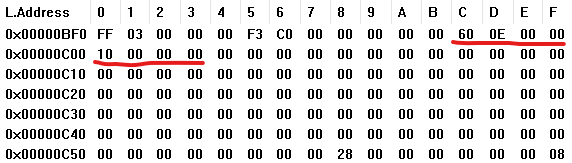
  
  其中，0x0e60即为内核栈的基地址，0x10即为新的堆栈段选择符ss，通过gdt表可以得知，0x10对应着内核数据段描述符。
* 通过上述这种方式进行了对ss和esp的设置，完成了栈的切换。

## 2.2 离开system_interrupt时
如第1部分中所示，在进入system_interrupt的同时，会把task0对应的一些重要寄存器的值压入task0的内核栈中。并且在离开时调用iret指令，将这些值弹栈并赋值给对应的寄存器，恢复到调用中断处理程序之前的状态，完成特权级以及栈的转变。

# 3. 当时钟中断发生，进入到 `timer_interrupt` 程序，请详细记录从任务 `0` 切换到任务 `1` 的过程。

第一次进入 timer_interrupt 程序，切换任务前各寄存器及tss0的状态（0xbf8位置处）：

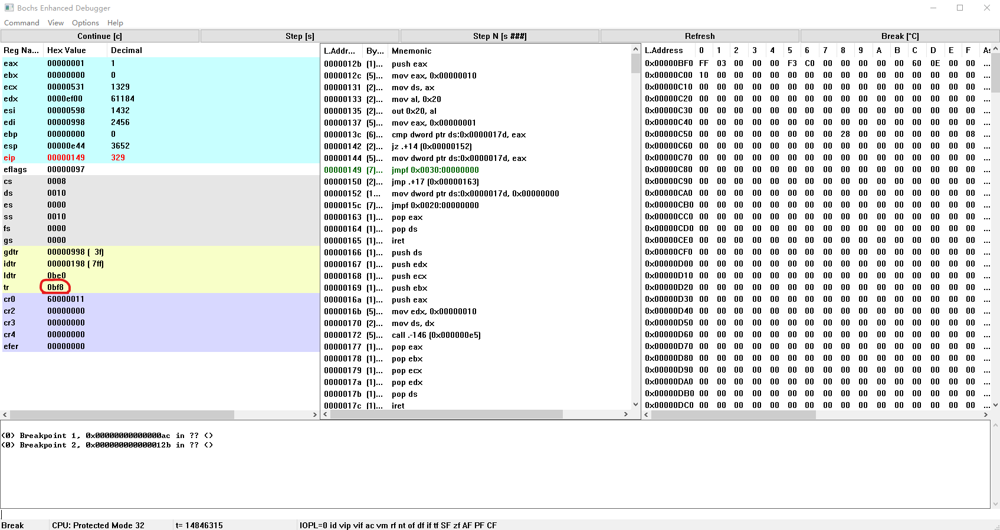

紧接着，切换到任务1后各寄存器及tss0的状态（0xbf8位置处）：

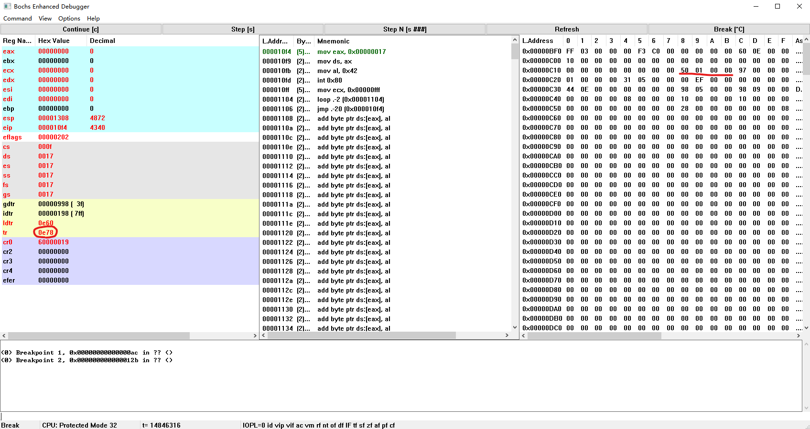

* 经过分析可以得到，执行 `ljmp $TSS1_SEL, $0` 指令改变了任务寄存器ts的值，使任务从task0切换到了task1。与此同时观察线性地址空间可以看到，处理器切换任务前的最后时刻在tss0中保存了当前任务所有寄存器的值，并且根据tss1中保存的数据更新了各个寄存器，顺利完成了从任务0向任务1的切换。
* 特别地，我们可以看到tss0在最近的更新之后，保存了离开timer_interrupt时的下一条指令的地址0x0150（图中红色横线处），这个值将会在将来再次进行ljmp指令进行任务切换时赋值给eip寄存器，这就解释了接下来的部分中将会说到的，为什么任务切换将会以那样一种看上去难以理解的方式在语句间进行跳转执行的原因。

# 4. 又过了 `10ms` ，从任务 `1` 切换回到任务 `0` ，整个流程是怎样的？ `TSS` 是如何变化的？各个寄存器的值是如何变化的？

* 又过了10ms后，再次发生时钟中断进入timer_interrupt程序，此时会在与eax寄存器（=1）的判等`cmpl %eax, current`后，经过跳转指令`je 1f`，来到标记1处，并且将会执行指令`ljmp $TSS0_SEL, $0`。
* 这条指令的执行过程与第3部分中所讲述的ljmp指令的行为是一样的，这个指令会将任务从task1切换回task0。但与上次不同的是，这次没有跳到task0中去执行代码，而是跳到了0x0150处的`jmp 2f`指令处执行，这个原因在上面已经说过了，是tss0中的值修改了eip寄存器而导致的。要注意到的是，硬件在执行指令时只会通过`cs:eip`的方式去取指令执行。
* 执行ljmp指令前后的现象如下面两张图所示。

从任务1切换回任务0前，各寄存器及tss1的状态（0xe78位置处）：

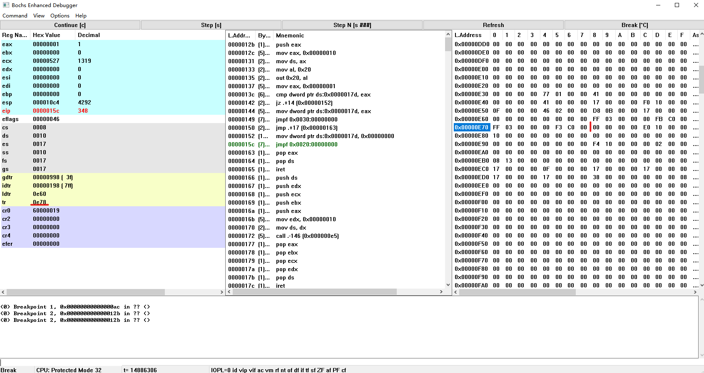

从任务1切换回任务0后，各寄存器及tss1的状态（0xe78位置处）：

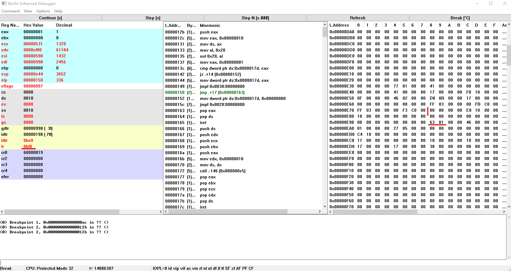

* 可以看到，任务寄存器tr的值回到了0xbf8，寄存器eip的值也确实变为了0x150，其他寄存器的值也均通过tss0中保存的数据一一进行了设置。
* 同样地，我们也看到了tss1发生的变化。由于任务由task1切换回了task0，因此要在tss1中将task1运行时最后的所有寄存器的值进行保存。我们同样可以看到，任务切换前，指令执行到了0x15c处，它的下一条指令的地址是0x163，因此我们也看到了0x163这个值确实保存在了tss1中，将来会在下一次任务切换中重新赋值给eip寄存器，并从那时ljmp指令处跳转到0x163位置的这条指令`popl %eax`继续执行下去。

# 5. 请详细总结任务切换的过程。

任务切换的全部过程如下图所示。

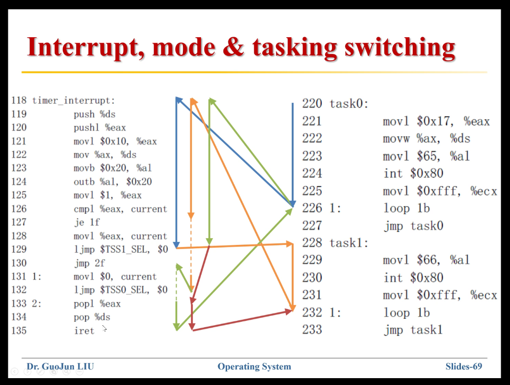

* 任务首先沿着蓝色箭头从task0的开始处进行执行，并且在226行的loop指令处发生时钟中断（极大概率如此，因为loop指令每执行一次都会将ecx寄存器中的值减1，而初始时设置ecx寄存器中的值为0xfff，即十进制的4095，因此task0的绝大多数时间都在运行loop语句，后面的task1也是如此），继续沿着蓝色箭头运行到129行，完成前面提到的一系列操作后，沿着黄色箭头跳转到task1处开始执行。
* 黄色箭头在执行到232行loop语句时发生时钟中断，并继续沿着黄色箭头从118行开始执行，直到132行进行任务切换。完成任务切换后，将会开始沿着浅绿色箭头回到第130行继续执行。（原因在前面已经详细讲述）
* 浅绿色箭头执行到iret语句后，将会回到当初第一次离开task0的地方继续执行，这是因为当初在离开task0进入timer_interrupt的时候会发生模式切换，task0的寄存器信息被压入task0的内核栈中，而此处执行iret语句会弹出这些栈中的内容并赋值给对应的寄存器。并且要注意到，此时已经完成从task1到task0的任务切换，此时的栈是task0的内核栈。
* 之后，继续执行task0，并将再次从loop语句处触发时钟中断，沿着浅绿色箭头继续执行到第129行处，完成任务切换后，沿着红色箭头跳转到第133行继续执行。（原因在前面已经详细讲述）
* 沿着红色箭头继续执行，再次执行到第135行iret指令的时候将会回到当初离开task1时的地方继续执行，原因与前面执行iret指令回到task0中的过程同理。要注意到，此时已经完成从task0到task1的任务切换，此时的栈是task1的内核栈。
* 之后将会进入一个稳定的状态，沿着红色、黄色、绿色箭头反复交替执行，并且在屏幕上不断的交替打印出A和B，10ms完成一次切换。任务切换的过程也与前面一致，基本不再发生变化。