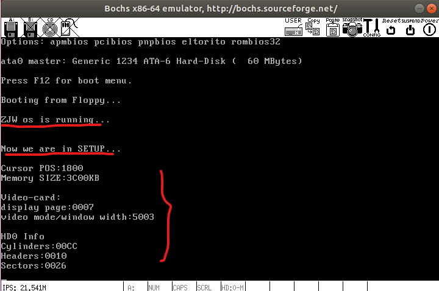

    19-lab03 report

# 1. 思考题

* `Question：` 
  *  有时，继承传统意味着别手蹩脚。 `x86` 计算机为了向下兼容，导致启动过程比较复杂。 请找出 `x86` 计算机启动过程中，被硬件强制，软件必须遵守的两个“多此一举”的步骤（多找几个也无妨），说说它们为什么多此一举，并设计更简洁的替代方案
* `Answer：` 
  * `（1）`在Linux0.00中，bios会自动将boot.s代码加载到内存0x7c00处，这个特性在Linux0.11中得到了保留。但我们看到的是，由于在0.11版本中从内存0x10000处移动到0x0处的代码不再是短短的head.s（移动后不会覆盖0x7c00处），而是更长的system模块（移动后会发生覆盖），因此与0.00中boot.s相对应的bootsect.s被加载到0x7c00后所做的第一个工作就是将自己移动到确保不会被覆盖的0x90000处，这个过程恰恰说明0x7c00这个默认加载的位置是不合适的，因此是“多此一举”的。
      
    `替代方案：`不再遵循0.00中的习惯，bios直接将bootsect.s代码加载到内存0x90000处即可，并且在bootsect.s中删去无用的自我移动代码，直接开始后面的读磁盘工作。
  * `（2）`由于在Linux0.00中，boot.s的长度很小，不超过512字节，因此可以完全被放在磁盘上第一个磁道的第一个磁盘块中，而bios也做成了默认将512个字节放在了内存0x7c00处的设计。但是我们看到，在Linux0.11中，事实上完成整个将system模块导入内存工作的代码不仅有bootsect.s，还有setup.s，它们两个合起来的功能相当于原先的boot.s，但是它们的大小之和超过了512字节（占用了1+4，共5个磁盘块），bios不能将其一口气导入内存，因此不能再合为一个形如“boot.s”的完整文件，而要拆分成两个文件，且第一个bootsect.s一定要小于512字节。bootsect.s导入内存并将自己移动到0x90000后，紧接着便将setup.s移动到了自己后面的0x90200处，很显然后面这个移动setup.s的操作是“多此一举”的，它受限于bios在0.00中默认只导入512字节代码的设计。

    `替代方案：`打破这个512字节的限制，使其可以一次性读入更多的代码到0x7c00处，并且将bootsect.s和setup.s文件合并成一个完整的boot.s文件，这样一来只需一次访问磁盘即可将这些代码全部写入内存。

* `综上所述：`摒弃0x7c00和512字节的限制，将两个文件合并成一个完整的boot.s文件，并一次性全部导入到内存的0x90000处。

# 2. 实验结果截图

* 我们可以看到，bootsect按照预期，正确显示了“ZJW os is running...”这句话。
* 显示了“Now we are in SETUP...”，意味着bootsect正确读入了setup。
* 下面的部分可以看到，setup正确的获取了硬件的参数，与老师在实验指导中所给的参考参数相吻合，并且正确的显示在了屏幕上。
* 我选择打印的硬件参数有：光标位置、内存大小、显卡信息和硬盘0的信息。满足“至少一个”的实验要求。
* `代码详见code文件夹中`。

# 3. 对代码的简单说明

* bootsect.s中初期添加了死循环语句，为了让程序在打印“ZJW os is running...”后停下来，后期为了让其成功进入setup.s`已经删掉`这个死循环，只保留了打印正确的信息。
* setup.s仿照原始的setup.s，获取了硬件的一些参数信息，并且存放在了内存中固定的地方。之后仿照修改后的bootsect.s程序，对这些硬件参数进行了屏幕输出，并仿照上面的思想加入了一个死循环，使程序在屏幕输出后卡住不动，不再继续执行。并且删去了setup.s中例如原本导入system模块等的那些无用汇编语句。