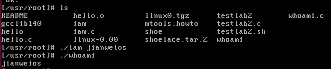
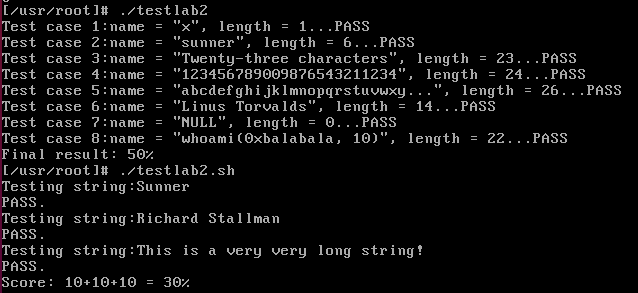
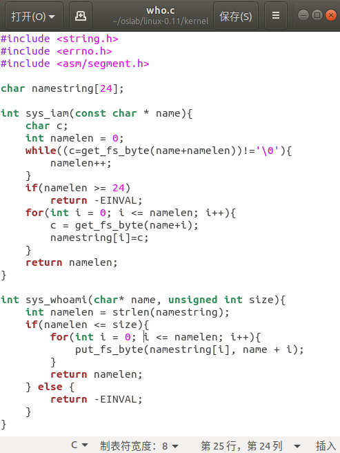
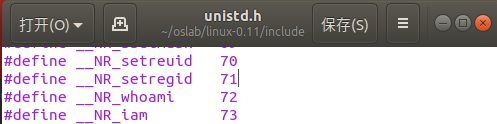
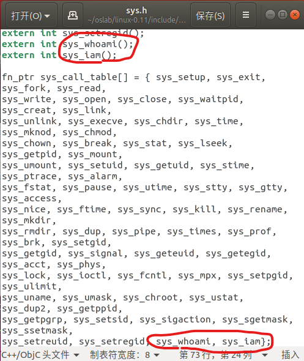
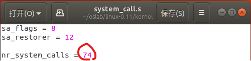
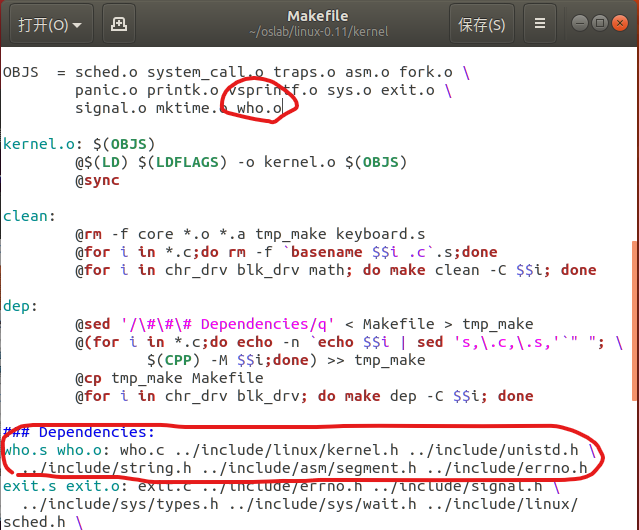
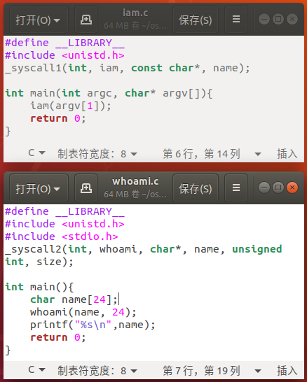
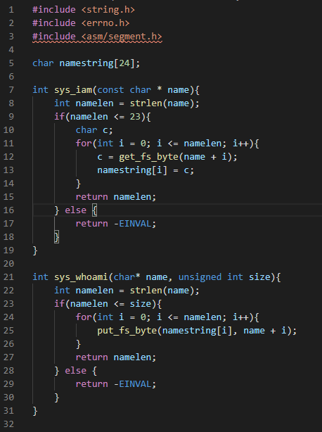

    19-lab04 report

# 1. 思考题

* `Question1`：

  从 `Linux 0.11` 现在的机制看，它的系统调用最多能传递几个参数？

* `Answer1`:

  最多只能传递传三个参数，这是因为只有ebx，ecx和edx三个通用寄存器用于存放参数的内容。

---
* `Question2`：
  
  你能想出办法来扩大这个限制吗？

* `Answer2`:
  * `特别说明：下面的答案不一定正确，但充分发挥了想象力……`
  1. 增加用于传递参数的通用寄存器的数量。
  2. 当机器的通用寄存器足够大时，对寄存器进行拆分，高低位分别存放不同的参数值。
  3. 在内存上开辟一段用户和内核都可以访问的栈空间，专门用于共享数据，如进行参数传递。此时通用寄存器可以用于指明栈中参数的个数，方便内核程序从栈顶弹出获取参数。
  4. 将参数放在用户栈中，通用寄存器中不存放参数本身而存放对应用户栈参数位置的指针，内核程序通过调用如get_fs_byte()等的函数，将参数从用户空间中获取，并放入内核空间中使用。

---
* `Question3`：
  
  用文字简要描述向 `Linux 0.11` 添加一个系统调用 `foo()` 的步骤。

* `Answer3`:
  1. 在`kernel`中实现真正有功能的内核函数`sys_foo()`。
  2. 在用户空间中（可以直接在应用程序中，也可以事先在一些库文件夹中）实现API，参数个数确定则可以直接用宏的形式，不确定则用宏展开的形式。
  3. 在`include/unistd.h`中添加`foo()`对应的系统调用号`__NR_foo`。
  4. 在`include/linux/sys.h`中添加声明`extern type sys_foo()`（此处type指的是返回值的类型，通常为int，因为在系统调用出现错误时通常要返回int类型的错误码errno），并在下面的系统调用函数表`sys_call_table`中添加`sys_foo`。
  5. 在`kernel/system_call.s`中修改变量`nr_system_calls`的值，这个变量指明系统调用的总数，因此需要加1。
  6. 修改`kernel/makefile`文件，在OBJS的结尾添加`foo.o`，并添加生成`foo.s`、`foo.o`的依赖。
  7. 之后，便可以直接在用户程序中使用系统调用函数`foo()`了。

# 2. 实验结果截图

* `iam`和`whoami`程序在linux0.11中运行的结果如下，可以看到传递的参数由iam保存在了内核空间中，并由whoami获取到了用户空间并打印了出来：

* 测试程序`testlab2`和`testlab2.sh`的运行结果如下，可以看到均得到了满分，说明实验结果正确：

# 3. 对代码和实验过程的截图及说明

* `特别说明：`实验过程参考实验指导书，以及仿照其中提到的一些已有的系统调用函数如`close()`、`write()`等完成，`具体过程与前面思考题第三问的回答基本一致`，因此不再赘述，直接参照思考题第三问的回答中所说的过程进行截图。
* 在`kernel/who.c`中实现真正有功能的内核函数`sys_iam()`和`sys_whoami()`，如下图所示：

* 在`include/unistd.h`中添加`iam()`和`whoami()`对应的系统调用号`__NR_iam`和`__NR_whoami`，如下图所示：

* 在`include/linux/sys.h`中添加声明`extern int sys_iam()`和`extern int sys_whoami()`，并在下面的系统调用函数表`sys_call_table`中添加`sys_iam`和`sys_whoami`，如下图所示：

* 在`kernel/system_call.s`中修改变量`nr_system_calls`的值，此时应为74（72 + 2），如下图所示：

* 修改`kernel/makefile`文件，在OBJS的结尾添加`who.o`，并添加生成`who.s`、`who.o`的依赖，如下图所示：

* 编写用户程序`iam.c`以及`whoami.c`，其中通过宏的方式编写了对应的API，并放在linux0.11的`/usr/root`路径下，二者代码如下图所示：

* 之后，将`testlab2.c`和`testlab2.sh`也移入到linux0.11的`/usr/root`下，并分别对`iam.c`、`whoami.c`和`testlab2.c`进行编译得到可执行文件，之后分别运行`三个可执行文件`及`testlab2.sh`即可完成实验。

# 4. 实验过程中遇到的问题及解决方法

1. `linux0.11下的vi`

    最开始在编写iam.c和whoami.c的时候，尝试直接在linux0.11环境下使用命令行工具vi进行编写，起初是正常的，但不久后便发现不再能够打开这两个文件，提示“xxx is busy”。找不到解决方法，不知道问题如何产生的，后决定在外面写完这两个文件再复制到linux0.11中。

2. `磁盘挂载问题`

    起初并不知道该怎么把文件复制到linux0.11下，后来发现应该通过`./mount-hdc`挂载磁盘映像，之后便可进行复制粘贴操作，在运行dbg-bochs时会提示自动解挂载，也可以使用命令`sudo umount hdc`来手动解挂载。

3. `运行iam.c时出现段错误`

    问题出在who.c，起初尝试如下图所示编写who.c的代码：

    

    必须要注意到，name所指的字符串是在用户空间的！如果尝试用strlen直接获取name的长度，便相当于直接从内核访问用户空间，这是不允许的，因此必须通过get_fs_byte()先将字符串导入内核空间，再想办法获取长度，进行判断、在内核空间中存放等等的操作。