<center>
    <font size=8>19-lab05 report</font>
</center>

# 1. 思考题

* `Question1`：

  结合自己的体会，谈谈从程序设计者的角度看，单进程编程和多进程编程最大的区别是什么？

* `Answer1`:

  单进程编程不需要考虑进程间的关系，不需要考虑将进程互相调度和共享资源，自己独享整个CPU资源。编程思路更简单。而多进程编程可以更大程度地利用CPU资源，并且可以实现进程间的信息交互，但是编程更困难，一旦调度处理不好就很容易出现致命错误，出现难以调试的问题。

---
* `Question2`：
  
  你是如何修改时间片的？仅针对样本程序建立的进程，在修改时间片前后，`log` 文件的统计结果（不包括Graphic）都是什么样？结合你的修改分析一下为什么会这样变化，或者为什么没变化？

* `Answer2`:

  我修改的是`/include/linux/sched.h`中的`INIT_TASK`：

  ```c
  #define INIT_TASK
    { 0,15,15, 
    ...
  ```

  其中，第一项是state，第二项是counter，第三项是priority。由于在所有状态号为0（TASK_RUNNING）的进程的counter值均归0的时候，执行的重置公式为：counter = counter / 2 + priority，因此可以看出修改时间片的关键在于priority。于是我尝试了将priority从15修改为30。log文件统计结果截图在下一部分中统一展示，此处不单独展示。修改后的现象变化不大，可能是因为时间片很小，远小于进程连续占用CPU的时间或者是I/O操作占用的时间，导致对进程整体的运行影响不大。

# 2. 部分代码及实验结果的截图及说明

* 首先，修改`/init/main.c`，如图所示。建立`process.log`文件的描述符。使log文件在进程0运行时即被创建，之后便可以开始记录进程运行轨迹。

  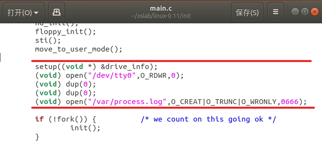

* 下面开始修改所有有关进程运行轨迹的文件及函数。经过对内核代码的阅读和理解，整理出以下需要进行fprintk记录轨迹的位置，如图所示。

  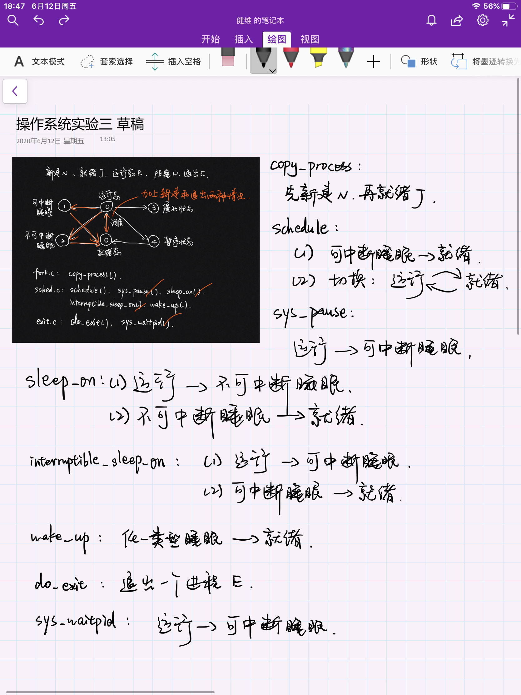

  * 总共需要修改这些文件和函数：
    * fork.c： copy_process()
    * sched.c： schedule()、sys_pause()、sleep_on()、interruptible_sleep_on()、wake_up().
    * exit.c： do_exit()、sys_waitpid()

  * 它们分别覆盖的进程状态切换动作如图中手写笔记所示。

* 在`/kernel/fork.c`中添加`创建进程（New）`的记录：

  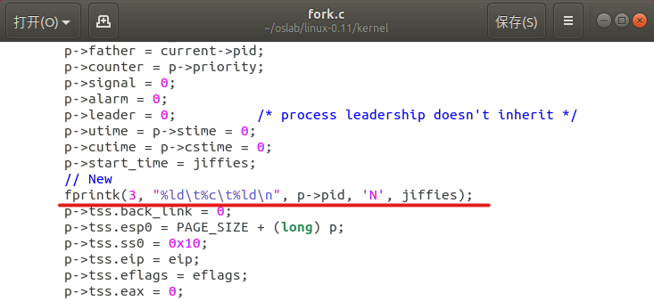

* 在`/kernel/fork.c`中添加进程进入`就绪态（Ready，下同）`的记录：

  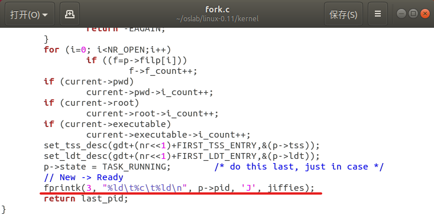

* 在`/kernel/sched.c`的`schedule()`中添加进程从`可中断睡眠（Interruptible sleeping，下同）`进入`就绪态`的记录，此处原程序唤醒一个从系统接收了信号的可中断程序：

  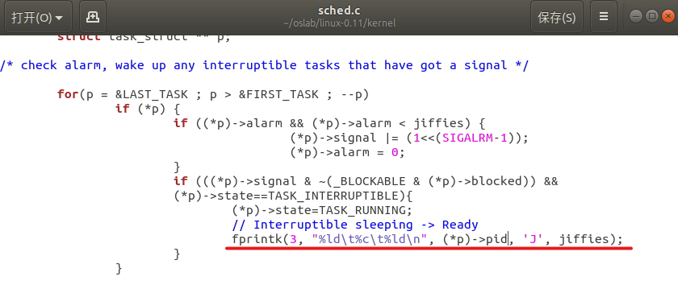

* 在`/kernel/sched.c`的`schedule()`中添加进程从`运行态（Running，下同）`进入`就绪态`，并将另一个进程从`就绪态`切换为`运行态`的记录，此处原程序进行了调度，切换了另一个处于就绪态的进程开始运行，并将原运行态程序放入就绪态。需要注意到的是，当新调度到的进程仍为原运行中的进程时，则意味着实际上没有发生调度切换，不打印任何信息；同时由于某些情况下（例如系统中只剩最后一个进程，且它无事可做时），current中的进程可能处于睡眠态，并不处于运行态，因此为了不打印多余的进入就绪态的信息，也添加了一个if判断：

  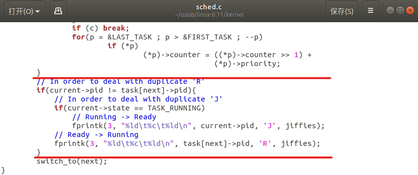

* 在`/kernel/sched.c`的`sys_pause()`中添加进程从`运行态`进入`可中断睡眠态`的记录：

  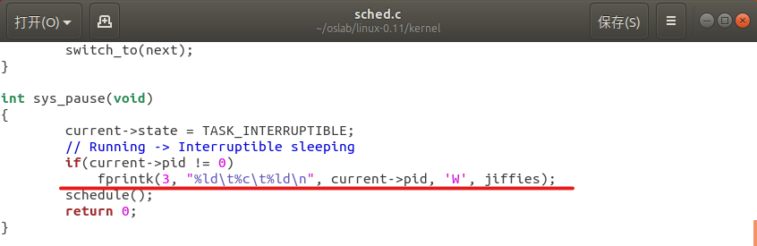

* 在`/kernel/sched.c`的`sleep_on()`中添加进程从`运行态`进入`不可中断睡眠态（Uninterruptible sleeping，下同）`，以及在schedule()后切换回`就绪态`的记录：

  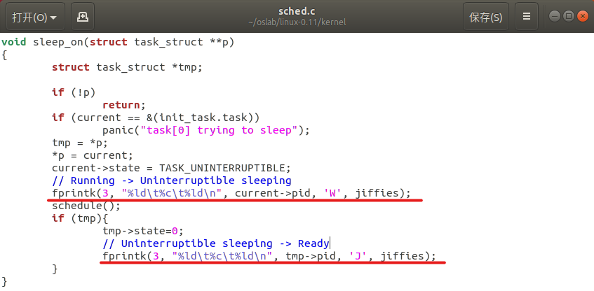

* 在`/kernel/sched.c`的`interruptible_sleep_on()`中添加进程从`运行态`进入`可中断睡眠态`，以及在schedule()后切换回`就绪态`的记录，注意这个地方有一个在队列中轮流唤醒、睡眠的寻找目标进程的过程：

  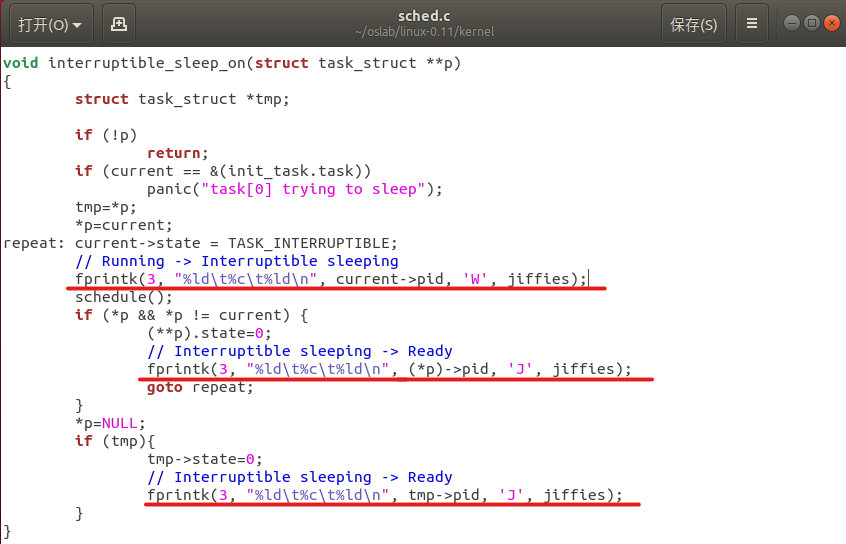

* 在`/kernel/sched.c`的`wake_up()`中添加进程从`睡眠态`回到`就绪态`的记录：

  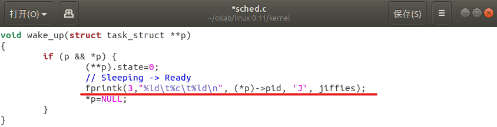

* 在`/kernel/exit.c`的`do_exit()`中添加进程`退出（Exit）`的记录：

  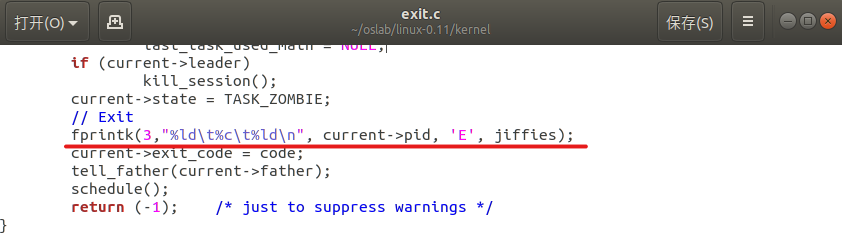

* 在`/kernel/exit.c`的`sys_waitpid()`中添加进程从`运行态`进入`可中断睡眠态`的记录，这应该是父进程在调用wait()后将自己睡眠，等待回收子进程时进行的系统调用：

  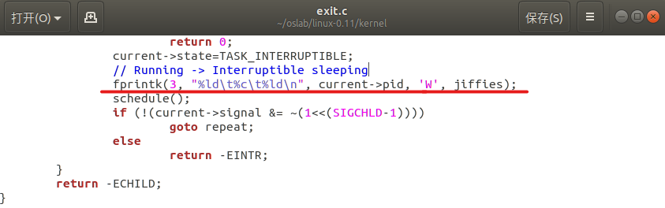

* 此时，所有的kernel文件已修改完成，运行linux0.11后，在ubuntu下挂载磁盘后查看`/hdc/var/process.log`中记录的结果，与实验指导书参考的结果相吻合：

  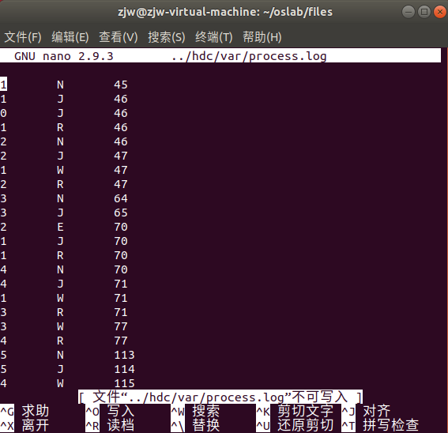

* 运行`stat_log.py`，可以看到对process.log的统计结果：

  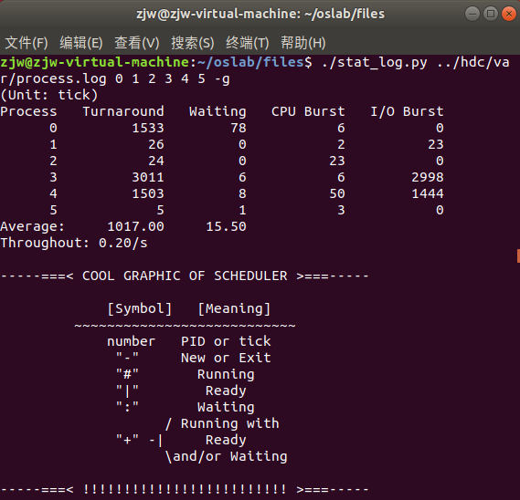

* 如下图所示，在`process.c`中编写了`main()`函数，使父进程创建了10个子进程，并逐一进行回收。所有子进程总的占用CPU和I/O的时间均为5秒，CPU占用时间从0-5递增，I/O占用的时间从5-0递减，并重复变化一次：

  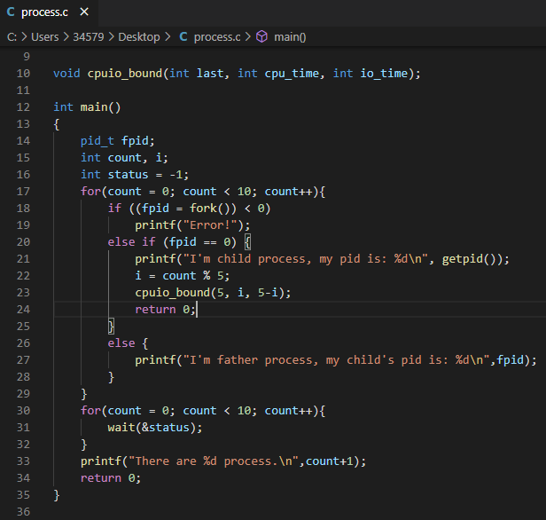

* 在linux0.11环境下编译`process.c`后，运行可执行文件`process`的结果如下：

  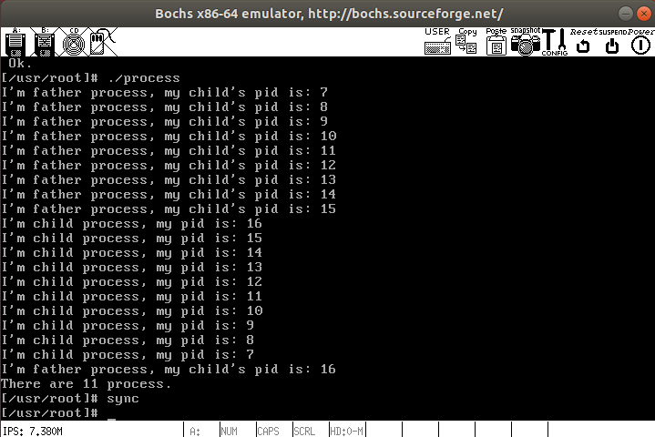

* 运行`process`后，在`process.log`中查看`pid = 15`的进程的运行统计信息结果如下：

  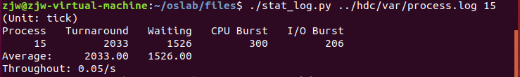

* 修改时间片，将第三个分量`priority`从`15`修改为`30`：

  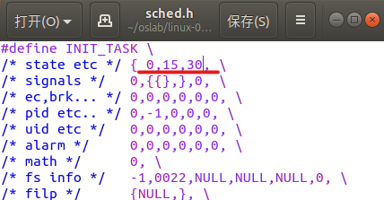

* 修改时间片后再次运行linux0.11，观察process.log中记录的滴答值的变化如下，对比前面的图可以看到变化并不明显：

  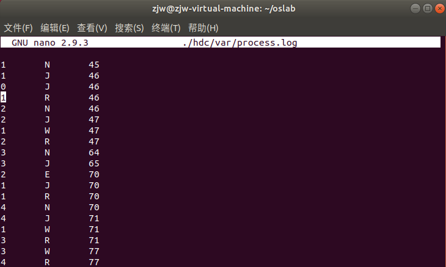

# 3. 实验过程中遇到的问题

1. `关于main()和init()的问题`

    首先说明，在老师提供的新版实验环境中，欲得到正确的实验结果，只能像前面的截图中所展示的那样，将下列代码从init()中删除，并移动到main()函数中才可以正确运行：

    ```c
    setup((void *) &drive_info);
    (void) open("/dev/tty0",O_RDWR,0);
  	(void) dup(0);
    (void) dup(0);
    (void) open("/var/process.log",O_CREAT|O_TRUNC|O_WRONLY,0666);
    ```

    经过测试，下面两种情况是会产生错误现象的：

    （1）将上面的最后一行代码直接添加在init()中，会导致在运行linux0.11后无法看到在process.log中有进程记录的过程，即这个文件将是空白的。

    （2）按照老师建议的尝试，在init()中的一处由0改为1，并不能得到正确的结果。虽然这时会在process.log中记录进程的轨迹，但是会导致开头丢失，例如pid = 1的进程的新建过程N，将不会被记录，这样在运行stat_log.py时将会得不到正确的结果。

2. `关于/kernel/sched.c中的interruptible_sleep_on()`

    这个函数中，下面这段代码的粗糙含义如我前面在报告中所说，不深入挖掘，凭直觉做是可以得到正确的实验结果的：

    ```c
    repeat:	current->state = TASK_INTERRUPTIBLE;
    // Running -> Interruptible sleeping
    fprintk(3, "%ld\t%c\t%ld\n", current->pid, 'W', jiffies);
    schedule();
    if (*p && *p != current) {
        (**p).state=0;
        // Interruptible sleeping -> Ready
        fprintk(3, "%ld\t%c\t%ld\n", (*p)->pid, 'J', jiffies);
        goto repeat;
    }
    ```

    但是对这个反复循环的repeat过程深入探究，便不太能详细了解其中对睡眠进程队列的管理过程的奥妙所在，简单说来，对于schedule和goto repeat两句代码运行的前后，可能受限于我们的C语言能力，对于各指针变量中的内容，也就是他们代表的进程，不能清晰理解，理解是混乱的，只能凭直觉和猜测继续实验。

    我为了尝试解决问题，参考了书《Linux内核完全剖析》，参考了学长当年做实验时的笔记，参考了网络查找的一些资料，以及跟些许同学进行了集体电话讨论，都没能够较为干净地梳理清楚这部分的代码执行过程，这是我实验中遇到的最大问题，尚未解决。