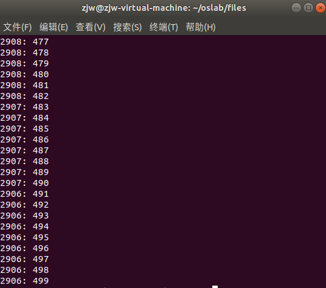
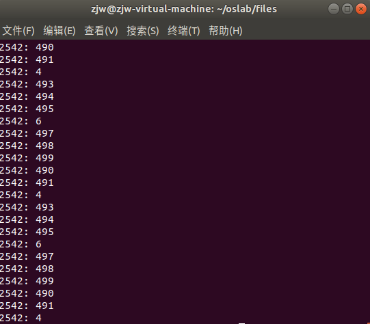
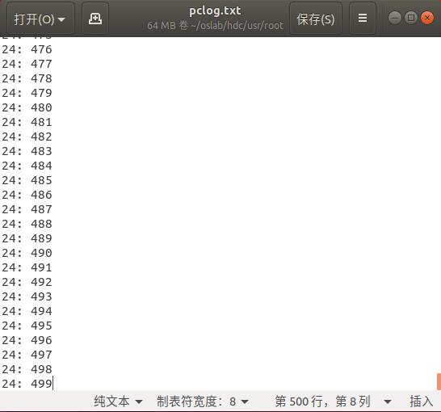
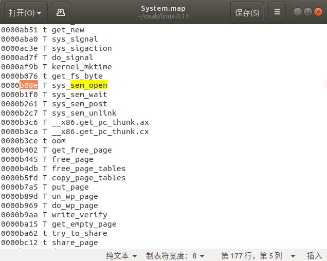
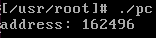
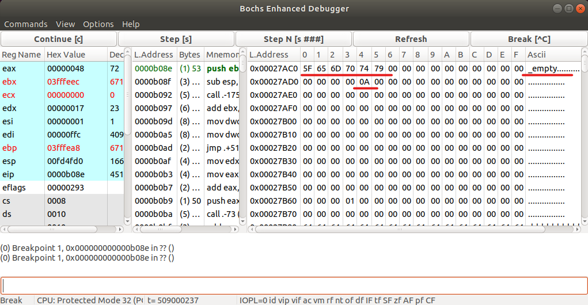

<center>
    <font size=8>19-lab06 report</font>
</center>

# 1. 思考题

* `Question1`：

  在 `pc.c` 中去掉所有与信号量有关的代码，再运行程序，执行效果有变化吗？为什么会这样？

* `Answer1`:

  修改前 `pc.c` 的运行结果如下图所示。

  

  去掉所有信号量相关代码后，执行结果有变化，变化后的结果如下图所示。
  
  

  可以看到，程序的执行结果变得无序，这是因为没有了信号量，进程之间不再能够合理调度，破坏了生产者消费者问题的规则。

---
* `Question2`：
  
  实验的设计者在第一次编写生产者——消费者程序的时候，是这么做的：
  ```c
  Producer()
  {
      P(Mutex);  //互斥信号量
      // 生产一个产品item;
      P(Empty);  //空闲缓存资源
      // 将item放到空闲缓存中;
      V(Full);  //产品资源
      V(Mutex);
  }

  Consumer()
  {
      P(Mutex);
      P(Full);
      // 从缓存区取出一个赋值给item;
      V(Empty);
      // 消费产品item;
      V(Mutex);
  }
  ```
  这样可行吗？如果可行，那么它和标准解法在执行效果上会有什么不同？如果不可行，那么它有什么问题使它不可行？

* `Answer2`:

  不可行，有可能会导致死锁。
  
  例如，当互斥信号量mutex=1，缓冲区中没有item（即full=0）时，如果接下来运行的是消费者进程，那么消费者会占用mutex锁，并卡在 `P(Full);` 处，等待由生产者执行 `V(Full);` 后再继续执行。接着，切换到生产者时，由于mutex锁已被刚才的消费者占用，未被释放，因此生产者会卡在 `P(Mutex);` 处，而无法执行后面的 `V(Full);` 语句，与消费者进程构成死锁。

# 2. 部分代码及实验结果的截图及说明

* 仿照Linux 0.11的第二次实验《系统调用》，进行下述修改操作，添加四个信号量操作的系统调用。
  
  * 在 `/include/linux` 中添加头文件 `sem.h` ，注意也要在挂载磁盘后移动到linux0.11下对应位置，如下所示：
    ```c
    # ifndef _SEM_H_
    # define _SEM_H_

    #include <linux/sched.h> 

    typedef struct sem_t{
        char name[20];
        int value;
        struct task_struct *queue;
    }sem_t;

    #endif
    ```
  * 在 `/kernel` 中添加实现信号量的代码 `sem.c` ，如下所示：
    ```c
    #include <linux/sem.h>
    #include <asm/segment.h>
    #include <unistd.h>
    #include <asm/system.h>
    #include <linux/kernel.h>

    #define SEMS_SIZE 5
    #define MAX_NAME 20

    sem_t sems[SEMS_SIZE] = {
        {"", 0, NULL},
        {"", 0, NULL},
        {"", 0, NULL},
        {"", 0, NULL},
        {"", 0, NULL},
    };

    sem_t * sys_sem_open(const char *name, unsigned int value){
        int i, index = -1;
        char temp_name[MAX_NAME];
        for(i = 0; i < MAX_NAME; i++){
            temp_name[i] = get_fs_byte(name+i);
            if(temp_name[i] == '\0')
                break;
        }

        if(i == 0 || i == MAX_NAME){
            printk("The length of name is unsuitable!\n");
            return NULL;
        }

        for(i = 0; i < SEMS_SIZE; i++){
            if(strcmp(sems[i].name, "") == 0){
                index = i;
                break;
            }
            else if(strcmp(sems[i].name, temp_name) == 0)
                return &sems[i];
        }

        sem_t *res = NULL;
        if(index != -1){
            res = &sems[index];
            strcpy(res->name, temp_name);
            res->value = value;
        }
        else
            printk("No empty slots!\n");
        return res;
    }

    int sys_sem_wait(sem_t *sem){
        cli();
        if(sem == NULL || sem < sems || sem >= sems + SEMS_SIZE){
            sti();
            return -1;
        }
        while(sem->value == 0)
            sleep_on(&sem->queue);
        sem->value--;
        sti();
        return 0;
    }

    int sys_sem_post(sem_t *sem){
        if(sem == NULL || sem < sems || sem >= sems + SEMS_SIZE)
            return -1;
        cli();
        wake_up(&sem->queue);
        sem->value++;
        sti();
        return 0;
    }

    int sys_sem_unlink(const char *name){
        int i; 
        char temp_name[MAX_NAME];
        for(i = 0; i < MAX_NAME; i++){
            temp_name[i] = get_fs_byte(name+i);
            if(temp_name[i] == '\0')
                break;
        }
        if(i == 0 || i == MAX_NAME)
            return -1;
        for(i = 0; i < SEMS_SIZE; i++){
            if(strcmp(sems[i].name, temp_name) == 0){
                sems[i].name[0] = '\0';
                sems[i].value = 0;
                sems[i].queue = NULL;
                return 0;
            }
        }
        return -1;
    }
    ```
  * 修改 `/kernel/Makefile` ，如下所示：
    ```c
    //在OBJS的最后添加上
    OBJS =  ... sem.o
    //在下面相应位置添加依赖
    sem.s sem.o: sem.c ../include/linux/sem.h ../include/linux/kernel.h \
    ../include/unistd.h
    ```
  * 修改 `/kernel/system_call.s` 中的系统调用总数：
    ```c
    //将原先的72改为76，因为添加了4个系统调用
    nr_system_calls = 76
    ```
  * 修改 `/include/linux/sys.h` 中的系统调用函数表：
    ```c
    //注意sys_sem_open的返回值类型要写成int，将来在linux0.11下编译pc.c时发出“返回值类型转换”的警告，忽视即可！
    extern int sys_sem_open();
    extern int sys_sem_wait();
    extern int sys_sem_post();
    extern int sys_sem_unlink();

    //在最后的sys_call_table[]中加上下面四项
    { ..., sys_sem_open, sys_sem_wait, sys_sem_post, sys_sem_unlink};
    ```
  * 在 `/include/unistd.h` 中添加四个系统调用号：
    ```c
    #define __NR_sem_open   72
    #define __NR_sem_wait   73
    #define __NR_sem_post   74
    #define __NR_sem_unlink 75
    ```
* 系统调用添加完毕后，使用自定义的信号量系统调用编写 `pc.c`。建议先在ubuntu下利用 `semaphore.h` 中的信号量函数写好 `pc.c` 后，并在ubuntu中运行无误之后再挂载磁盘，复制到linux0.11下。这样只需对信号量函数稍作修改即可，避免在linux0.11下运行结果发生错误时，无法定位是生产者消费者问题中的错误还是自定义信号量函数中的错误。在linux0.11中修改后的 `pc.c` 的代码如下所示：
  ```c
  #define __LIBRARY__
  #include<stdio.h>
  #include<stdlib.h>
  #include<unistd.h>
  #include<linux/sem.h>
  #include<signal.h>
  #include<sys/types.h>
  #include<fcntl.h> 
  
  #define producer_N 1
  #define consumer_N 5
  #define Buffer_N 10
  #define Buffer_M 500

  _syscall2(int, sem_open, const char*, name, unsigned int, value);
  _syscall1(int, sem_wait, sem_t*, sem);
  _syscall1(int, sem_post, sem_t*, sem);
  _syscall1(int, sem_unlink, const char*, name);

  int buf_in, buf_out, fd;
  sem_t *empty, *full, *mutex;

  void producer()
  {
    int item_num = 0;
          while(item_num < Buffer_M)
    {
      sem_wait(empty);
      sem_wait(mutex);
      if (lseek(fd, buf_in * sizeof(int), SEEK_SET) < 0)
                    fprintf(stderr, "Error in producer lseek\n");
                  write(fd, (char*)&item_num, sizeof(int));
                  buf_in = (buf_in + 1) % Buffer_N;
                  sem_post(mutex);
      sem_post(full);
                  item_num++;
    }
          close(fd); 
  }

  void consumer()
  {
    int item_num, limit, i;
          limit = Buffer_M / consumer_N;
          for(i = 0; i < limit; i++)
          {
      sem_wait(full);
      sem_wait(mutex);
      lseek(fd, Buffer_N * sizeof(int), SEEK_SET);
                  read(fd, (char*)&buf_out, sizeof(int));
                  lseek(fd, buf_out * sizeof(int), SEEK_SET);
                  read(fd, (char*)&item_num, sizeof(int));
                  buf_out = (buf_out + 1) % Buffer_N;
                  lseek(fd, Buffer_N * sizeof(int), SEEK_SET);
                  write(fd, (char*)&buf_out, sizeof(int));
                  printf("%d: %d\n", getpid(), item_num);
                  fflush(stdout);
      sem_post(mutex);
                  sem_post(empty);		
    }
          close(fd);
  }

  int main()
  {
    char *_empty = "_empty";
          char *_full = "_full";
          char *_mutex  = "_mutex";
        
          pid_t ret1[producer_N], ret2[consumer_N];
          int i, status, item_num;
          buf_in = 0;
          buf_out = 0;

          fd = open("share_buffer", O_CREAT | O_RDWR | O_TRUNC, 0666);
          lseek(fd, Buffer_N * sizeof(int), SEEK_SET);
          write(fd, (char*)&buf_out, sizeof(int));
    empty = sem_open(_empty, Buffer_N);
    full = sem_open(_full, 0);
          mutex = sem_open(_mutex, 1);
          
    for(i = 0; i < producer_N; i++) {
      if((ret1[i]= fork()) == 0) {
                          producer();
                          return 0;
                  }
                  else if(ret1[i] < 0) {
              printf("producer %d failed to create! \n", i);
        return -1;
                  }
    }
    for(i = 0; i < consumer_N; i++) {
      if((ret2[i] = fork())== 0) {
                          consumer();
                          return 0;
                  }
                  else if(ret2[i] < 0) {
              printf("consumer %d failed to create! \n", i);
        return -1;
                  }    
    }
    for(i = 0; i < producer_N; i++)
      waitpid(ret1[i],&status,0);
    for(i = 0; i < consumer_N; i++)
      waitpid(ret2[i],&status,0);
          sem_unlink(_empty);
          sem_unlink(_full);
          sem_unlink(_mutex);
          close(fd);
          return 0;
  }
  ```
* 在linux0.11下编译，并通过 `./pc > pclog.txt` 运行，将运行结果记录到文本文件中。挂载磁盘，将 `pclog.txt` 用文本编辑器打开，可以看到运行现象正确，如下图所示：

  

# 3. 实验过程中遇到的问题

1. `实验中曾经出现过自定义的信号量函数sem_open()失败的情况，信号量并没有正确的被打开并赋予初始值，因此无法正常使用信号量。`因此通过如下方式debug，最终解决了问题：
    
    * 在 `System.map` 中找到 `sys_sem_open()` 的代码地址：
      
      

    * 使用bochsgui设置断点，跟踪 `sys_sem_open()`：

      

    * 在代码中添加了打印信号量地址的语句：
      ```c
      printf("address: %d\n", empty);
      ```
    * 根据打印的地址（十进制162496），在 `bochsgui` 中查看内存空间对应位置的信息，即可看到信号量是否成功被创建并写入内存：

      

      
    * 可以看到，在经过了debug后，信号量的名字 `_empty` 以及初始值 `10（0x0A）` 成功的存入了内存的对应位置，信号量创建成功。