<center>
    <font size=8>19-lab07 report</font>
</center>

# 1. 思考题

* `Question1`：

  对于地址映射实验部分，列出你认为最重要的那几步（不超过 `4` 步），并给出你获得的实验数据。

* `Answer1`:

  1. 通过汇编代码得到变量 `i` 的逻辑地址，并通过 `gdt` 表、`ldt` 表，找到数据段的线性基地址；
  2. 将数据段的线性基地址与逻辑地址中的偏移量组合，得到变量 `i` 的线性地址，然后通过查看 `CR3` 寄存器的值找到页目录表所在的位置，通过线性地址逐层查找，各种拼接，得到最后的物理地址；
  3. 直接修改物理地址中存放的值，恢复程序运行，程序即会退出循环。

  我获得的实验数据将在下面的第 `2` 节中通过截图详细展示。

---
* `Question2`：
  
  `test.c` 退出后，如果马上再运行一次，并再进行地址跟踪，你发现有哪些异同？为什么？

* `Answer2`:

  1. 首先，`ldt` 表的线性地址发生了变化，变为了 `0x00fd42d0` ：
    
      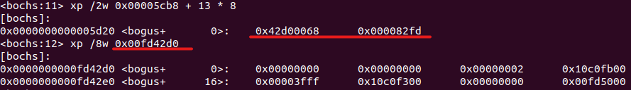
  2. 页表的物理地址发生了变化，变为了 `0x00fa6000` ：

      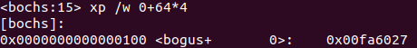
  3. 同样，变量 `i` 所在页的物理基址也发生了变化，变为了 `0x00fa3000` ：
      
      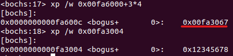
  
  这应该是因为现在运行 `test` 的与第一次不再是同一个进程，它要重新申请物理内存，有新的页表，同时进程在创建时也要建立新的 `ldt` 表，因此他们的地址都会发生变化。

# 2. 部分代码及实验结果的截图及说明

## 第一部分：跟踪地址翻译过程

### （1）通过逻辑地址，寻找线性地址：

* 将 `test.c` 程序停在 `cmp ...` 一句，可以看到变量 `i` 的逻辑地址为 `ds:0x3004` 。通过 `sreg` 命令查看各寄存器的值，可以看到 `gdt` 存放在线性地址 `0x00005cb8` 的位置，而 `ldt` 的段描述符存放在gdt表的第 `14` 项（index为 `13` ，0x0068 = 0000000001101000， 段选择子去掉最后三位得到index为二进制1101）：

  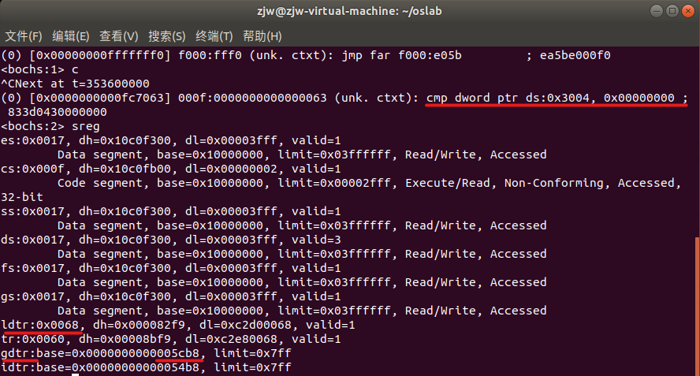

* 查看gdt表中index为13的描述符，即可看到ldt表存放在线性地址 `0x00f9c2d0` 位置处，再由段寄存器 `ds` 的值（0x0017 = 0000000000010111），可以看出数据段描述符放在ldt表的第 `3` 项（index为二进制0010）:

  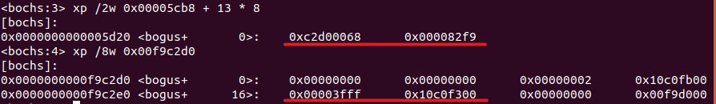

* 根据数据段描述符的值，可以得到数据段位于线性地址 `0x10000000` 位置处，加上偏移量 `0x3004` ，得到变量 `i` 的线性地址 `0x10003004` ，下面这条命令也证实了我们的分析：

  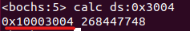

### （2）通过线性地址，寻找物理地址：

* 通过 `creg` 命令，查看 `CR3` 寄存器中存放的页目录表位置，可以看到页目录表的基址为0；解析刚才得到的线性地址，得知页目录号为 `64` （二进制0001000000），页号为 `3` （二进制0000000011），页内偏移为 `4` （二进制000000000100），于是我们首先查看页目录表的第 `65` 项：

  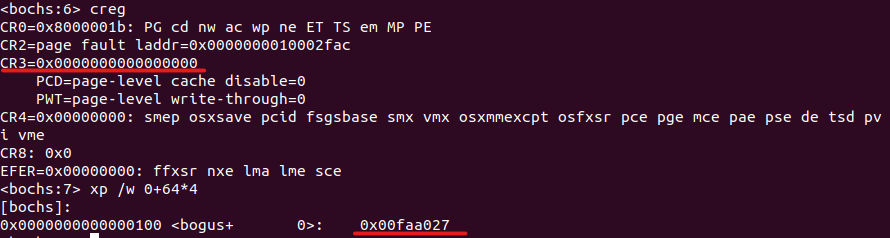

* 扔掉后12位属性，可以得到页表所在的物理页框号为 `0x00faa` ，也就是说，页表的物理基地址为 `0x00faa000` ，查看页表的第 `4` 项，得到变量 `i` 所在页的物理基址为 `0x00fa7000` ；再加上页内偏移量，即可得到变量 `i` 存放的真正物理地址为 `0x00fa7004` ，查看其中的值，我们可以看到变量 `i` 的初始值 `0x12345678` 确实存放在此处，印证了我们前面过程的正确性：

  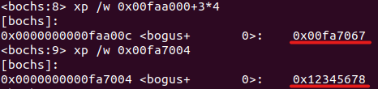

### （3）修改物理地址中的值，使程序退出循环：

* 通过命令 `setpmem 0x00fa7004 4 0` ，我们修改了这个物理地址处四个字节的值为 `0` ，这样一来变量 `i` 的值就变成了 `0x00000000` ，接着我们通过命令 `c` 让 `test` 程序恢复运行：

  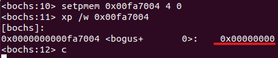

* 这时我们可以在 `bochs` 界面看到，程序成功退出了循环，运行结束：

  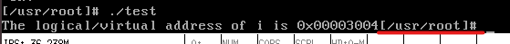

## 第二部分：共享内存的实现及基于共享内存的生产者-消费者程序

* 由上次实验的 `pc.c` 修改后的生产者代码 `producer.c` 如下：

  ```c
  #define __LIBRARY__
  #include<stdio.h>
  #include<stdlib.h>
  #include<unistd.h>
  #include<sys/types.h>
  #include<fcntl.h> 
  #include<sys/wait.h>
  #include<linux/sem.h>

  _syscall2(int, shmget, int, key, size_t, size);
  _syscall1(int, shmat,  int, shmid);
  _syscall2(int, sem_open, const char*, name, unsigned int, value);
  _syscall1(int, sem_wait, sem_t*, sem);
  _syscall1(int, sem_post, sem_t*, sem);
  _syscall1(int, sem_unlink, const char*, name);

  #define Buffer_N 10
  #define Buffer_M 500

  sem_t *empty, *full, *mutex;

  int main()
  {
    char *_empty = "_empty";
          char *_full = "_full";
          char *_mutex  = "_mutex";
        
          int *buf;
          int i, item_num, shmid, buf_in = 0;

    empty = sem_open(_empty, Buffer_N);
    full = sem_open(_full, 0);
          mutex = sem_open(_mutex, 1);
          
          shmid = shmget(1314, Buffer_N);
          printf("shmid:%d\n", shmid);
          fflush(stdout);
          if(shmid == -1){
              fprintf(stderr, "Error to open shm_ds!");
              return -1;
          }
          buf = (int*)shmat(shmid);
          printf("Begin to produce.\n");
          fflush(stdout);

          for(item_num = 0; item_num < Buffer_M; item_num++){
        sem_wait(empty);
        sem_wait(mutex);
              buf[buf_in] = item_num;
              printf("produce %d.\n", item_num);
              fflush(stdout);
              buf_in = (buf_in+1)%Buffer_N;
              sem_post(mutex);
        sem_post(full);
    }
          printf("Produce finished.\n");
          fflush(stdout);
    
          return 0;
  }
  ```

* 由上次实验的 `pc.c` 修改后的消费者代码 `consumer.c` 如下：

  ```c
  #define __LIBRARY__
  #include<stdio.h>
  #include<stdlib.h>
  #include<unistd.h>
  #include<sys/types.h>
  #include<fcntl.h> 
  #include<sys/wait.h>
  #include<linux/sem.h>

  _syscall2(int, shmget, int, key, size_t, size);
  _syscall1(int, shmat,  int, shmid);
  _syscall2(int, sem_open, const char*, name, unsigned int, value);
  _syscall1(int, sem_wait, sem_t*, sem);
  _syscall1(int, sem_post, sem_t*, sem);
  _syscall1(int, sem_unlink, const char*, name);

  #define Buffer_N 10
  #define Buffer_M 500

  sem_t *empty, *full, *mutex;

  int main()
  {
    char *_empty = "_empty";
          char *_full = "_full";
          char *_mutex = "_mutex";
        
          int *buf;
          int i, item_num, shmid, buf_out = 0;

    empty = sem_open(_empty, Buffer_N);
    full = sem_open(_full, 0);
          mutex = sem_open(_mutex, 1);
          
          shmid = shmget(1314, Buffer_N);
          printf("shmid:%d\n", shmid);
          fflush(stdout);
          if(shmid == -1){
              fprintf(stderr, "Error to open shm_ds!");
              return -1;
          }
          buf = (int*)shmat(shmid);
          printf("Begin to consume.\n");
          fflush(stdout);

          for(i = 0; i < Buffer_M; i++){
              sem_wait(full);
        sem_wait(mutex);
        item_num = buf[buf_out];
              buf_out = (buf_out+1)%Buffer_N;
        sem_post(mutex);
              sem_post(empty);
              printf("pid: %d, consume %d.\n", getpid(), item_num);
              fflush(stdout);		
    }
          printf("Consume finished.\n");
          fflush(stdout);
    
          sem_unlink(_empty);
          sem_unlink(_full);
          sem_unlink(_mutex);

          return 0;
  }
  ```

* 实现共享内存的两个系统调用代码 `shm.c` 如下：

  ```c
  #include <linux/shm.h>
  #include <linux/mm.h>
  #include <linux/sched.h>
  #include <unistd.h>
  #include <linux/kernel.h>
  #include <errno.h>

  #define SHM_SIZE 3

  shm_ds shm_list[SHM_SIZE] = {
      {0,0,0},
      {0,0,0},
      {0,0,0}
  };

  int sys_shmget(int key, size_t size){
          
          unsigned long page;
          
          if(key <= 0 || size > PAGE_SIZE || size <= 0){
              printk("Error! Illegal parameter!\n");
              errno = EINVAL;
              return -1;
          }

          int i;
          for(i = 0; i < SHM_SIZE; i++){
              if(shm_list[i].key == key)
                  return i;
          }
          
          page = get_free_page();
          if(!page){
              printk("Error! Allocate failed!\n");
              errno = ENOMEM;
              return -1;
          }
          else{
              printk("Allocated a page at 0x%08x\n", page);
          }
  
          for(i = 0; i < SHM_SIZE; i++) {
              if(shm_list[i].key == 0) {
                  shm_list[i].key = key;
                  shm_list[i].size = size;
                  shm_list[i].page = page; 
                  return i;
              }
          }
          
          printk("Error! No empty slot!\n");
          errno = ENOMEM;
          return -1;
  }

  void *sys_shmat(int shmid) {
          unsigned long data_base, brk;
          if(shmid < 0 || shmid >= SHM_SIZE || shm_list[shmid].key == 0)
              return (void *)-EINVAL;
          data_base = get_base(current->ldt[2]);
          printk("Current data-segment's linear address: 0x%08x, page's pysical address: 0x%08x\n", data_base, shm_list[shmid].page);
          brk = current->brk + data_base;
          current->brk += PAGE_SIZE;
          if(put_page(shm_list[shmid].page, brk) == 0){
              errno = ENOMEM;
              return (void *)-1;
          }
          return (void *) (current->brk - PAGE_SIZE);
  }
  ```

* 分别编译后，使用命令 `./producer > producer.txt & ./consumer > consumer.txt` 同时运行，并将运行结果分别打在文件里，下图可以看到成功申请了一页的物理内存，并分别由生产者消费者进行了共享，有着不同的线性地址：
  
  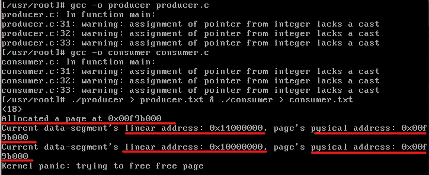

* 程序运行结束后，结果如下，可以看到得到了正确的实验结果：

  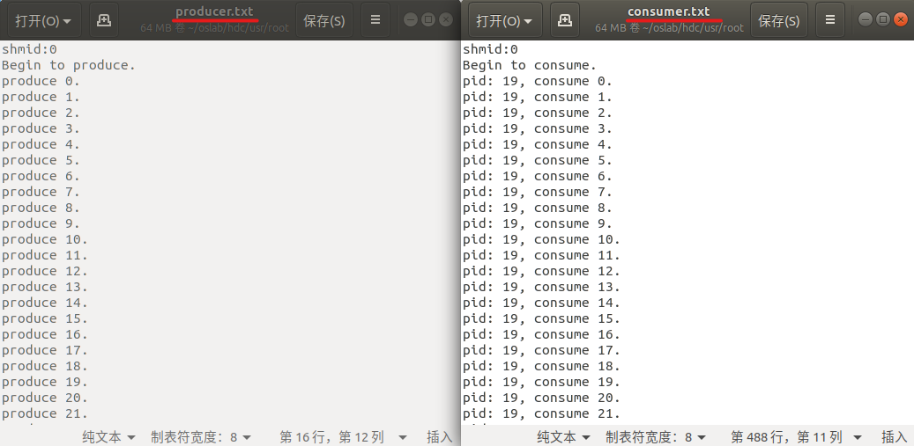

  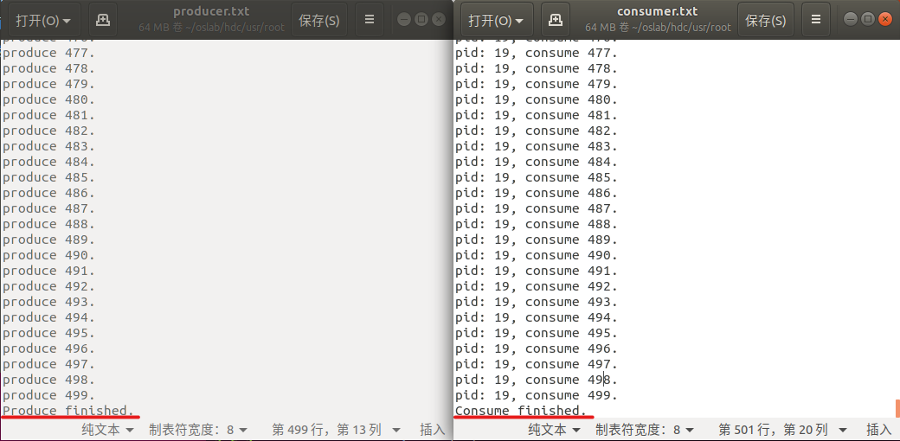

# 3. 实验过程中遇到的问题

1. 在上面的截图中可以看到，在运行生产者-消费者的代码后，出现了错误 `Kernel panic: trying to free free page`，经过分析，这应该是因为在运行结束后对先前申请的、且已经无用的一页大小物理内存没有手动回收导致的。应该可以通过再实现一个类似于 `shmfree()` （名字瞎起的）的释放共享内存的系统调用来解决，并在消费者最后退出前调用，手动释放掉内存，但由于这超出了实验要求，因此也没再予以实现，不影响实验结果。