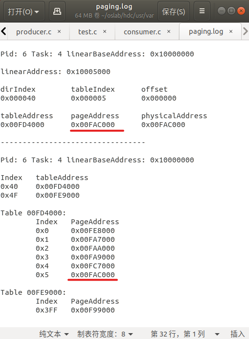
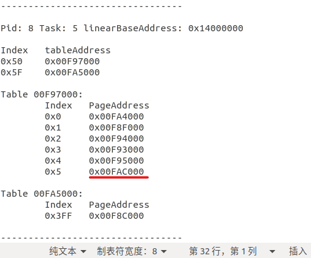

<center>
    <font size=8>19-lab08 report</font>
</center>

# 1. 思考题

* `Question1`：

  页表中正在使用的页表项是连续的吗？这体现了分页的什么优点？

* `Answer1`:

  页表项（下标）是连续的，但是页的地址是不连续的。这体现了分页机制在管理上的统一、方便，以及对内存分配的灵活性，对内存使用的高效性，极大地减少了外部碎片的产生。

---
* `Question2`：
  
  你觉的分段是必要的吗？现在的 `Linux (x86-64)` 是怎么处理分段的？

* `Answer2`:

  是必要的，这样可以将内存分成几个部分，根据不同的功能和需要访问不同的部分，互不干扰，保证了进程使用内存时的整齐划一，同时也保证了系统的安全性。比方说执行的代码一定存放在代码段中，其他需要用到的数据放在数据段、堆栈段中，数据段、堆栈段中的内容不可以覆盖代码段的内容，以防恶意攻击系统，注入非法代码。同时也方便了寻址，取代码时使用cs寄存器中的值作为基址（这里只是简单这么说，实际上的各种转换过程暂时忽略），使用数据时使用ds寄存器作为基址，整齐划一，十分规则，

  现在的 `Linux (x86-64)` 如我刚才所说，是通过各种寄存器（cs，ds，ss等），各种描述符表（先gdt，再ldt，最后再分出代码段描述符、数据段描述符等等）来进行分段的，内存诞生时系统自动分配64MB的空间，并按照下图的顺序将内存空间切分成各个段。

  

  而各个段的实际长度信息也会在进程的 `pcb` （linux系统中为 `task_struct` 结构体）中保存，例如 `end_code` 、 `end_data` 等等。

# 2. 部分代码及实验结果的截图及说明

* 首先根据实验指导书在 `/kernel/printk.c` 添加系统调用fprintk()，注意下面是 `current` ：

  ```c
  if (!(file=current->filp[fd]))
      return 0;
  inode=file->f_inode;
  ```

* 在 `/include/linux/kernel.h` 中添加声明：

  ```c
  int fprintk(int fd, const char *fmt, ...);
  ```

* 在 `kernel/dbgpg.c` 中实现如下系统调用：

  ```c
  int debug_paging(pid_t pid, void *address, const char *logPath);
  ```

  完整代码内容，以及对代码的解释如下：

  ```c
  #include <linux/mm.h>
  #include <linux/sched.h>
  #include <unistd.h>
  #include <linux/kernel.h>
  #include <errno.h>
  #include <fcntl.h>

  int sys_debug_paging(pid_t pid, void *address, const char *logPath){
      int i, j = -1;
      /*在task数组中找到对应pid的位置，即任务号*/
      for(i = 0; i < NR_TASKS; i++){
          if(task[i]->pid == pid){
              j = i;
              break;
          }
      }
      /*默认文件描述符为1，即stdout，如果用户有指定文件路径则创建新的文件描述符*/
      int fd = 1;
      if(logPath != NULL){
          fd = open(logPath, O_CREAT|O_APPEND, 0666);
      }
      if(fd < 0){
          printk("\nFailed to open a file!\n");
          printk("\n---------------------------------\n");
          errno = EINVAL;
          return -1;
      }
      if(j == -1){
          fprintk(fd, "\nPid is not exist!\n");
          fprintk(fd, "\n---------------------------------\n");
          errno = EINVAL;
          return -1;
      }
      /*进程空间的线性基地址即为代码段的基地址start_code*/
      int linearBaseAddress = task[j]->start_code;
      fprintk(fd, "\nPid: %d Task: %d linearBaseAddress: 0x%08X\n", pid, j, linearBaseAddress);
      /*当用户有指定要翻译的地址时*/
      if(address != NULL){
          /*解析线性地址*/
          int linearAddress = linearBaseAddress + address;
          fprintk(fd, "\nlinearAddress: 0x%08X\n", linearAddress);
          int dirIndex = (linearAddress >> 22) & 0x3FF;
          int tableIndex = (linearAddress >> 12) & 0x3FF;
          int offset = linearAddress & 0xFFF;
          fprintk(fd, "\ndirIndex\ttableIndex\toffset\n");
          fprintk(fd, "0x%06X\t0x%06X\t0x%06X\n", dirIndex, tableIndex, offset);
          /*查询页目录表、页表和页的地址，最终得到物理地址*/
          int pageDirectoryTable = (task[j]->tss).cr3;
          int tableAddress = (*(int *)(pageDirectoryTable + dirIndex * 4)) & 0xFFFFF000;
          int pageAddress = (*(int *)(tableAddress + tableIndex * 4)) & 0xFFFFF000;
          int physicalAddress = pageAddress + offset;
          fprintk(fd, "\ntableAddress\tpageAddress\tphysicalAddress\n");
          fprintk(fd, "0x%08X\t0x%08X\t0x%08X\n", tableAddress, pageAddress, physicalAddress);
      }
      /*当没有指定地址，则打出该进程所有页表和页的信息*/
      else {
          int dirIndex = (linearBaseAddress >> 22) & 0x3FF;
          int pageDirAddress = (task[j]->tss).cr3;
          int tableAddress;
          int dirIndexArray[20];
          int tableAddressArray[20];
          int P;
          i = 0;
          /*找到一个进程对应的16个页目录表项（页表地址）中有效的那些项，并存放在数组中供后续使用*/
          for(j = 0; j < 16; j++){
              P = (*(int *)(pageDirAddress + dirIndex * 4)) & 0x1;
            if(P) {
                  tableAddress = (*(int *)(pageDirAddress + dirIndex * 4)) & 0xFFFFF000;
                  dirIndexArray[i] = dirIndex;
                  tableAddressArray[i] = tableAddress;
                  i++;
              }
              dirIndex += 1;
          }
          fprintk(fd,"\nIndex\ttableAddress\n");
          for(j = 0; j < i; j++) {
              fprintk(fd, "0x%X\t0x%08X\n", dirIndexArray[j], tableAddressArray[j]);
          }
          int pageAddress;
          int tableIndex;
          /*对每一个有效的页表，找到对应的1024个页表表项（页地址）中有效的那些项*/
          for(j = 0; j < i; j++) {
            fprintk(fd, "\nTable %08X:\n", tableAddressArray[j]);
              fprintk(fd, "\tIndex\tPageAddress\n");
              for(tableIndex = 0; tableIndex < 1024; tableIndex++) {
                pageAddress = (*(int *)(tableAddressArray[j] + tableIndex * 4)) & 0xFFFFF000;
                P = (*(int *)(tableAddressArray[j] + tableIndex * 4)) & 0x1;
                  if(P){
                    fprintk(fd,"\t0x%X\t0x%08X\n", tableIndex, pageAddress);
                  }
              }
          }
      }
      fprintk(fd, "\n---------------------------------\n");
      if(fd != 1){
          close(fd);
      }
      return 0;
  }
  ```

* 在 `linux-0.11` 下运行实验指导书中的测试代码 `test.c` ，运行结果如下：

  * 控制台：
    
    

  * `/usr/var/paging.log` 文件：

    

  * 可以看到，符合要求地完成了地址转换，及查询页表地址、页地址的过程。

* 在 `linux-0.11` 下按照实验指导书中的要求，先后执行命令 `./producer &` 及 `./consumer` ，运行结果如下：

  * `/usr/var/paging.log` 文件：

    
    
    

  * 可以看到，生产者和消费者进程共享了内存，共享的内存页地址为 `0x00FAC000` 。

# 3. 实验过程中遇到的问题

* 起初，不知道如何得到系统中进程的相关信息，如pid、每个进程保存的寄存器的值、ldt等等进程的管理信息。

  `解决方法：` 联想到上一次实验使用 `current` 中存放的 `ldt` 信息，我查看了 `current` 的类型以及定义它的位置，于是查看了 `/linux-0.11/include/sched.h` ，看到了 `current` 的类型 `task_struct` 的定义，这也就是一个进程的 `pcb` ，这个结构体的内容如下：

  ```c
  struct task_struct {
  /* these are hardcoded - don't touch */
    long state;	/* -1 unrunnable, 0 runnable, >0 stopped */
    long counter;
    long priority;
    long signal;
    struct sigaction sigaction[32];
    long blocked;	/* bitmap of masked signals */
  /* various fields */
    int exit_code;
    unsigned long start_code,end_code,end_data,brk,start_stack;
    long pid,father,pgrp,session,leader;
    unsigned short uid,euid,suid;
    unsigned short gid,egid,sgid;
    long alarm;
    long utime,stime,cutime,cstime,start_time;
    unsigned short used_math;
  /* file system info */
    int tty;		/* -1 if no tty, so it must be signed */
    unsigned short umask;
    struct m_inode * pwd;
    struct m_inode * root;
    struct m_inode * executable;
    unsigned long close_on_exec;
    struct file * filp[NR_OPEN];
  /* ldt for this task 0 - zero 1 - cs 2 - ds&ss */
    struct desc_struct ldt[3];
  /* tss for this task */
    struct tss_struct tss;
  };
  ```

  其中我发现，字段 `pid` 即存放了这个进程的 `pid` 值信息； `start_code` 则存放了代码段的起始地址，而在一个进程的内存空间中，第一个部分也就是代码段，也就是说这个地址也即是这整个进程的线性基地址；最后一个字段 `tss` 顾名思义应该存放了一个进程所保存的所有寄存器值的信息，它是一个 `tss_struct` 类型的结构体，它的定义也在 `/linux-0.11/include/sched.h` 中，如下所示：

  ```c
  struct tss_struct {
    long	back_link;	/* 16 high bits zero */
    long	esp0;
    long	ss0;		/* 16 high bits zero */
    long	esp1;
    long	ss1;		/* 16 high bits zero */
    long	esp2;
    long	ss2;		/* 16 high bits zero */
    long	cr3;
    long	eip;
    long	eflags;
    long	eax,ecx,edx,ebx;
    long	esp;
    long	ebp;
    long	esi;
    long	edi;
    long	es;		/* 16 high bits zero */
    long	cs;		/* 16 high bits zero */
    long	ss;		/* 16 high bits zero */
    long	ds;		/* 16 high bits zero */
    long	fs;		/* 16 high bits zero */
    long	gs;		/* 16 high bits zero */
    long	ldt;		/* 16 high bits zero */
    long	trace_bitmap;	/* bits: trace 0, bitmap 16-31 */
    struct i387_struct i387;
  };
  ```

  这里我们就可以看到存放了页目录表地址信息的 `cr3` 寄存器的值了。因此不难发现，只要得到了一个进程对应的 `tss_struct` 结构体，就可以得到我们想要的所有信息！那么如何寻找一个进程的 `tss_struct` 呢？我们看到我们熟悉的 `current` 定义在了不远的地方，而它的上面则有一个与之类型相同（都是 `tss_struct *` 类型）的数组，名为 `task` ：

  ```c
  extern struct task_struct *task[NR_TASKS];
  extern struct task_struct *last_task_used_math;
  extern struct task_struct *current;
  extern long volatile jiffies;
  extern long startup_time;
  ```

  从名字不难猜测，这个数组即存放了当前系统中所有的进程信息，不论其处于什么状态（正在运行、睡眠、就绪等），因此也如前面代码展示那一部分中所写的那样，我在 `dbgpg.c` 的代码中，写了下面这样一个循环：

  ```c
  int i, j = -1;
  /*在task数组中找到对应pid的位置，即任务号*/
  for(i = 0; i < NR_TASKS; i++){
      if(task[i]->pid == pid){
          j = i;
          break;
      }
  }
  ```

  这样一来便可以根据 `pid` 的值，在 `task` 数组中得到对应进程的下标，即任务号，存放在此处的变量 `j` 中，供后面的代码使用。