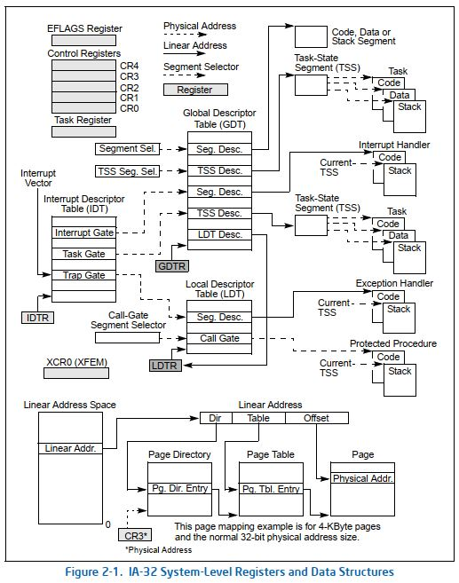
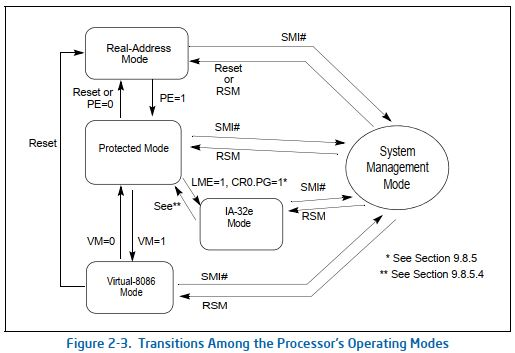
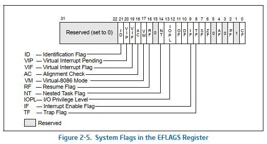
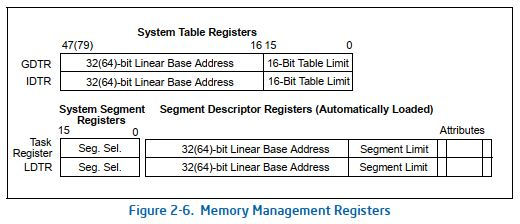
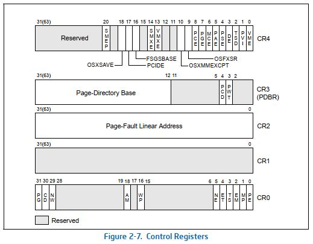
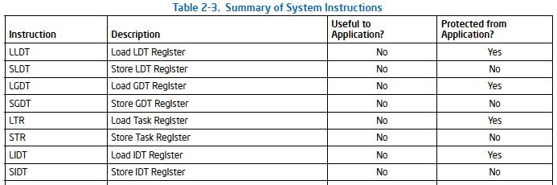

    读书笔记 1

    1170300432 张健维

# 1 系统级体系结构概览
## 1.1 Global and Local Descriptor Tables
 
    Global and Local Descriptor Tables，中文名为“全局和局部描述符表”（下面简称GDT和LDT），记录了一种名为“段描述符”的条目。内存空间中通常含有代码段、数据段和堆栈段。在保护模式下运行时，所有对于内存的访问操作都需要通过GDT或者LDT来得到所需访问内存中段的基地址。之后结合偏移地址得到真实的物理地址，并且在权限合适的前提下，即可访问到内存中的一个有效段。
 
 
    一种称之为“段选择器”的部件提供了上述的偏移地址、用来指示指向GDT或LDT的全局/本地标志，以及刚才提到的访问权限信息。每一个段描述符都有一个与之相对应的段选择器。另外，还有两个分别称为GDT寄存器（GDTR）和LDT寄存器（LDTR）的寄存器，它们分别存放着GDT和LDT的基地址。
 

---
## 1.2 System Segments, Segment Descriptors, and Gates
 
    上面说到的代码段、数据段和堆栈段为程序或过程的执行提供了环境，除此以外，该体系结构还有两个系统段，分别称为“任务状态段”（下面简称TSS）和LDT。由于无法通过段选择器和段描述符对GDT进行访问，所以它不被作为一个段，而TSS和LDT拥有为他们定义的段描述符，因此被视为系统段。
 
 
    该体系结构还定义了一组名为“门”的特殊描述符，包括调用门、中断门、陷阱门和任务门。它们为系统过程和一些处理程序提供了受保护的途径，使得后者可以在与大多数应用程序和过程的权限级别不同的情况下运行。例如对调用门的调用可以访问到代码段中的过程，这个代码段的权限级别与当前代码段的特权级别相一致或更高。为了通过调用门访问一个过程，调用过程提供了对于这个调用门的选择器。处理器会在这个调用门上进行权限检查，即：将当前权限等级与调用门的权限等级以及调用门指向的目标代码段的权限等级进行比较。
 
 
    经过比较，如果允许访问目标代码段，则处理器将得到目标代码段的段选择器和与调用门之间的偏移地址。如果该调用需要更改权限，则处理器还会将当前的堆栈切换到目标权限级别的堆栈。新堆栈的段选择器是由当前运行任务的TSS提供的。这些门还有助于在16位和32位的代码段互相切换。
 

---
## 1.3 Task-State Segments and Task Gates
 
    TSS定义了任务执行环境的状态。它包括通用寄存器，段寄存器，EFLAGS寄存器，EIP寄存器和具有用于三个堆栈段的堆栈指针（每个特权级别一个堆栈）的段选择器的状态。TSS还包括与任务相关联的LDT的段选择器和分页层次结构的基址。
 
 
    在保护模式下，所有程序执行都在一个任务（称为当前任务）的上下文中发生。当前任务的TSS的段选择器存储在任务寄存器中。切换到任务的最简单方法是进行一个调用或者跳转到新任务。在此，新任务的TSS的段选择器在CALL或JMP指令中给出。在切换任务时，处理器执行以下操作：
 

- 1、将当前任务的状态存储在当前TSS中。
- 2、使用新任务的段选择器加载任务寄存器。
- 3、通过GDT中的段描述符访问新的TSS。
- 4、将新任务的状态从新的TSS加载到通用寄存器，段寄存器，LDTR，控制寄存器CR3（分页层次结构的基地址），EFLAGS寄存器和EIP寄存器中。
- 5.开始执行新任务。也可以通过任务门来访问任务。任务门类似于调用门，此外它还提供（通过段选择器）对TSS而非代码段的访问。

---
## 1.4 Interrupt and Exception Handling
 
    外部中断、软件中断和异常通过一个称为“中断描述符表”（IDT）的结构来处理。IDT是一个存储门描述符的集合，这些描述符提供对中断和异常处理程序的访问。像GDT一样，IDT也不是一个系统段。IDT基址的线性地址存放在IDT寄存器（IDTR）中。IDT中的门描述符可以是中断，陷阱或任务门描述符。 为了访问中断或异常处理程序，处理器首先通过INT，INTO，INT 3或BOUND指令从内部硬件，外部中断控制器或软件接收中断向量（标记中断类型的编号）。中断向量提供IDT的索引。如果所选的门描述符是中断门或陷阱门，则与通过调用门调用过程相类似的方式访问关联的处理程序。如果描述符是任务门，则通过任务开关访问处理程序。
 

---
## 1.5 Memory Management
 
    该系统体系结构支持内存的直接物理地址寻址或通过分页技术实现的虚拟内存。使用物理寻址时，线性地址被视为是物理地址。而使用分页技术时，所有代码、数据、堆栈和系统段（包括GDT和IDT）都可以被分页，而仅将最近访问的页面保留在物理内存中。
 
 
    页面（有时也被称为页面框架）在物理内存中的真实位置包含在分页结构中。这些结构驻留在物理内存中（图2-1展示的是32位的分页）。分页层次结构的基本物理地址存放在控制寄存器CR3中。分页结构中的条目确定页面框架基础的物理地址、访问权限和内存管理信息。
    要使用这种分页机制，线性地址分为多个部分。这些部分为页面结构和页面框架提供了单独的偏移量。一个系统可以具有一个或多个分页结构的层次结构。例如，每个任务可以有自己的层次结构。
 

---
## 1.6 System Registers
 
    为了协助处理器的初始化和控制系统操作，系统体系结构在EFLAGS寄存器和几个系统寄存器中提供了如下系统标志：
 

- EFLAGS寄存器中的各种系统标志（flags）和IOPL字段控制任务和模式切换、中断处理、指令跟踪和访问权限。将在本读书报告的下面小节中进一步介绍。
- 控制寄存器（CR0，CR2，CR3和CR4）包含用于控制系统级操作的各种标志和数据字段。这些寄存器中的其他标志用于指示对操作系统或执行程序中特定处理器功能的支持。将在本读书报告的下面小节中进一步介绍。
- 调试寄存器（图2-1中未显示）允许设置断点，以用于调试程序和系统软件。本读书报告不涉及。
- 内存管理寄存器GDTR、LDTR和IDTR，包含其各自表的线性地址和大小限制。将在本读书报告的下面小节中进一步介绍。
- 任务寄存器TR包含当前任务的TSS的线性地址和大小。将在本读书报告的下面小节中进一步介绍。
- 特定于模型的寄存器（图2-1中未显示，简称为MSR）是一组寄存器，主要可用于操作系统或执行过程（即以特权级别0运行的代码）。这些寄存器控制项目，例如调试扩展，性能监视计数器，机器检查体系结构和内存类型范围（MTRR）。

 
    这些寄存器的数量和功能在Intel 64和IA-32处理器家族的不同成员之间有所不同。大多数系统都限制应用程序对系统寄存器（EFLAGS寄存器除外）的访问。但是，可以设计系统使所有程序和过程都以最高特权级别（特权级别0）运行。不过这种情况下将会允许应用程序修改系统寄存器。
 
 
    下面附上图2-1：
 
 
 

    

 
 

---
# 2 实模式和保护模式转换
 
    IA-32支持三种操作模式和一种准操作模式，他们分别是：
 

- 保护模式（Protected mode）
- 实模式（Real-address mode）
- 系统管理模式（System management mode, SMM）
- 虚拟8086模式（Virtual-8086 mode）

 
    下面将讨论前两种模式，后两种模式不在本文的讨论范畴内。
 
 
 

    

 
 
 
    上图展示了这些操作模式之间的大致状态转换关系。在机器处于刚上电或复位后的较短时间内，处理器将处于实地址模式中。控制寄存器CR0中的PE标志控制着处理器是在实地址还是在保护模式下运行：当PE置为0，将由保护模式切换到实模式中；当PE置为1，将从实模式切换进入保护模式。
 
 
    此处查阅了网上的一些资料，下面引用网上得到的一些信息：
 
 
    在计算机上面，实模式存在的时间非常之短，所以一般我们感觉不到它的存在。CPU复位（reset）或加电（power on）的时候就是以实模式启动，在这个时候处理器以实模式工作，不能实现权限分级，也不能访问20位以上的地址线（即只能访问1M内存）。之后通常就加载操作系统模块，并进入保护模式。处理器8086有20根地址线，可以寻址1MB的内存。但是，它内部的寄存器16位的，无法在程序中访问整个1MB内存。所以，它也是第一款支持内存分段模型的处理器。此外，8086处理器只有一种工作模式，即实模式。当然在那时，还没有实模式这一种说法。
 
 
    由于8086处理器的成功，推动着Intel公司不断地研发更新的处理器，32位的时代就这样到来了。尽管8086是16位的处理器，但它也是32位架构内的一部分。原因在于：32位的处理器架构是从8086发展而来的，是基于8086的，具有延续性和兼容性。不过，32位处理器有自己的32位工作模式，而保护模式其实就是32位模式。在这种模式下，可以完全、充分地发挥处理器的性能。同时，在这种模式下，处理器可以使用它全部的32根地址线，能够访问4GB内存。
 
 
    由此可以了解到，保护模式和实模式的转换方式以及需要进行的修改内容。二者具有不同的意义，对于处理器的完全性能、安全性的保护也不一样，因此也可以看出二者转换的必要性。
 

---
# 3 80x86系统指令寄存器
## 3.1 标志寄存器（EFLAGS）
 
    下面附上标志寄存器EFLAGS的结构图：
 
 
 

    

 
 
 
    32位的EFLAGS寄存器包含一组状态标志、系统标志以及一个控制标志。在x86处理器初始化之后，EFLAGS寄存器的状态值为00000002H。第1、3、5、15以及22到31位均被保留，除了第1位置为1外，其他保留位均置为0，这个寄存器中的有些标志通过使用特殊的通用指令可以直接被修改，但并没有指令能够检查或者修改整个寄存器。当调用中断或异常处理程序时，处理器将在程序栈上自动保存EFLAGS的状态值。
 

### 3.1.1 状态标志
- CF(bit 0) [Carry flag]   若算术操作产生的结果在最高有效位(most-significant bit)发生进位或借位则将其置1，反之清零。这个标志指示无符号整型运算的溢出状态，这个标志同样在多倍精度运算(multiple-precision arithmetic)中使用。
- PF(bit 2) [Parity flag]   如果结果的最低有效字节(least-significant byte)包含偶数个1位则该位置1，否则清零。
- AF(bit 4) [Adjust flag]   如果算术操作在结果的第3位发生进位或借位则将该标志置1，否则清零。这个标志在BCD(binary-code decimal)算术运算中被使用。
- ZF(bit 6) [Zero flag]   若结果为0则将其置1，反之清零。
- SF(bit 7) [Sign flag]   该标志被设置为有符号整型的最高有效位。(0指示结果为正，反之则为负)
- OF(bit 11) [Overflow flag]   如果整型结果是较大的正数或较小的负数，并且无法匹配目的操作数时将该位置1，反之清零。这个标志为带符号整型运算指示溢出状态。

### 3.1.2 DF标志
- 这个方向标志(位于EFLAGS寄存器的第10位)控制串指令(MOVS, CMPS, SCAS, LODS以及STOS)。设置DF标志使得串指令自动递减（从高地址向低地址方向处理字符串），清除该标志则使得串指令自动递增。STD以及CLD指令分别用于设置以及清除DF标志。

### 3.1.3 系统标志及IOPL域
EFLAGS寄存器中的这部分标志用于控制操作系统或是执行操作，它们不允许被应用程序所修改。这些标志的作用如下：
- TF(bit 8) [Trap flag]   将该位设置为1以允许单步调试模式，清零则禁用该模式。
- IF(bit 9) [Interrupt enable flag]   该标志用于控制处理器对可屏蔽中断请求(maskable interrupt requests)的响应。置1以响应可屏蔽中断，反之则禁止可屏蔽中断。
- IOPL(bits 12 and 13) [I/O privilege level field]   指示当前运行任务的I/O特权级(I/O privilege level)，正在运行任务的当前特权级(CPL)必须小于或等于I/O特权级才能允许访问I/O地址空间。这个域只能在CPL为0时才能通过POPF以及IRET指令修改。
- NT(bit 14) [Nested task flag]   这个标志控制中断链和被调用任务。若当前任务与前一个执行任务相关则置1，反之则清零。
- RF(bit 16) [Resume flag]   控制处理器对调试异常的响应。
- VM(bit 17) [Virtual-8086 mode flag]   置1以允许虚拟8086模式，清除则返回保护模式。
- AC(bit 18) [Alignment check flag]   该标志以及在CR0寄存器中的AM位置1时将允许内存引用的对齐检查，以上两个标志中至少有一个被清零则禁用对齐检查。
- VIF(bit 19) [Virtual interrupt flag]   该标志是IF标志的虚拟镜像(Virtual image)，与VIP标志结合起来使用。使用这个标志以及VIP标志，并设置CR4控制寄存器中的VME标志就可以允许虚拟模式扩展(virtual mode extensions)。
- VIP(bit 20) [Virtual interrupt pending flag]   该位置1以指示一个中断正在被挂起，当没有中断挂起时该位清零。与VIF标志结合使用。处理器只读这个标志位，但从不修改。
- ID(bit 21) [Identification flag]   程序能够设置或清除这个标志指示了处理器对CPUID指令的支持。

---
## 3.2 内存管理寄存器（GDTR, LDTR, IDTR, TR）
 
    下面附上内存管理寄存器（包含GDTR, LDTR, IDTR 和 TR 四个寄存器）的结构图：
 
 
 

    

 
 
 
    处理器提供了四个存储器管理寄存器（GDTR，LDTR，IDTR和TR），这些寄存器指定控制分段存储器管理的数据结构的位置（见图2-6）。提供了用于加载和存储这些寄存器的特殊说明。
 

### 3.2.1 GDTR
GDTR寄存器保存基址（GDT在保护模式下为32位；在IA-32e模式下为64位）和GDT的16位表限制。基地址指定GDT字节0的线性地址；表限制指定表中的字节数。LGDT和SGDT指令分别加载和存储GDTR寄存器。处理器加电或重置时，基地址设置为默认值0，限制设置为0FFFFH。作为保护模式操作的处理器初始化过程的一部分，必须将新的基地址加载到GDTR中。

### 3.2.2 LDTR
LDTR寄存器包含16位段选择器，基地址（在保护模式下为32位；在IA-32e模式下为64位），段限制和LDT的描述符属性。基地址指定了LDT段的字节0的线性地址；段限制指定段中的字节数。LLDT和SLDT指令分别加载和存储LDTR寄存器的段选择器部分。包含LDT的段必须在GDT中具有段描述符。当LLDT指令在LDTR中加载段选择器时：来自LDT描述符的基地址，限制和描述符属性将自动加载到LDTR中。发生任务切换时，将为LDTR自动加载新任务的LDT的段选择器和描述符。在将新的LDT信息写入寄存器之前，不会自动保存LDTR的内容。在处理器加电或复位时，段选择器和基地址设置为默认值0，限制设置为0FFFFH。

### 3.2.3 IDTR
IDTR寄存器保存IDT的基址（在保护模式下为32位；在IA-32e模式下为64位）和IDT的16位表限制。基地址指定IDT字节0的线性地址；表限制指定表中的字节数。LIDT和SIDT指令分别加载和存储IDTR寄存器。处理器加电或重置时，基地址设置为默认值0，限制设置为0FFFFH。然后，可以在处理器初始化过程中更改寄存器中的基址和限制。

### 3.2.4 TR
任务寄存器包含16位段选择器，基地址（在保护模式下为32位；在IA-32e模式下为64位），段限制和当前任务的TSS的描述符属性。选择器在GDT中引用TSS描述符。基地址指定TSS字节0的线性地址；段限制指定TSS中的字节数。LTR和STR指令分别加载和存储任务寄存器的段选择器部分。当LTR指令在任务寄存器中加载段选择器时，TSS描述符中的基地址，限制和描述符属性将自动加载到任务寄存器中。处理器加电或重置时，基地址设置为默认值0，限制设置为0FFFFH。发生任务切换时，任务寄存器会自动加载新任务的TSS的段选择器和描述符。在将新的TSS信息写入寄存器之前，不会自动保存任务寄存器的内容。

---
## 3.3 控制寄存器（本文只涉及CR0 ~ CR3）
 
    下面附上控制寄存器（包含CR0 ~ CR4共五个寄存器，本文只涉及前四个）的结构图：
 
 
 

    

 
 
 
    控制寄存器（CR0，CR1，CR2，CR3和CR4；见图2-7）确定处理器的操作模式以及当前正在执行的任务的特征。 在所有32位模式和兼容模式下，这些寄存器均为32位。
 

- CR0：包含用于控制处理器的运行模式和状态的系统控制标志。
- CR1：保留。
- CR2：包含页面错误线性地址（导致页面错误的线性地址）。
- CR3：包含分页结构层次结构的基础的物理地址和两个标志（PCD和PWT）。仅指定基址的最高有效位（减去低12位）；地址的低12位假定为0。因此，第一个分页结构必须与页面（4 KB）对齐边界。PCD和PWT标志控制处理器内部数据缓存中该分页结构的缓存（它们不控制页面目录信息的TLB缓存）。使用物理地址扩展时，CR3寄存器包含页面目录指针表的基地址。在IA-32e模式下，CR3寄存器包含PML4表的基地址。

 
    加载控制寄存器时，保留位应始终设置为先前读取的值。下面是对CR0 ~ CR3寄存器中这些标记位的说明：
 

- PG：分页（CR0的第31位），设置时启用分页；清除时禁用分页。禁用分页时，所有线性地址均被视为物理地址。 如果也未设置PE标志（寄存器CR0的位0），则PG标志无效。PE标志清除时设置PG标志会导致一般保护异常（#GP）。
- CD：禁用缓存（CR0的第30位），清除CD和NW标志时，将启用处理器内部（和外部）缓存中整个物理内存的内存位置缓存。设置CD标志时，限制缓存。为了防止处理器访问和更新其高速缓存，必须设置CD标志并且必须使高速缓存无效，以便不会发生高速缓存命中。
- NW：非直写（CR0的第29位），清除NW和CD标志后，将启用回写（对于Pentium 4，Intel Xeon，P6家族和Pentium处理器）或直写（对于Intel486处理器） 命中高速缓存的写操作和无效周期被启用。
- AM：对齐掩码（CR0的第18位），设置后启用自动对齐检查。清除时禁用对齐检查。仅当设置了AM标志，设置了EFLAGS寄存器中的AC标志，CPL为3并且处理器以保护模式或虚拟8086模式运行时，才执行对齐检查。
- WP：写保护（CR0的第16位），置位时，禁止管理员级过程将其写入只读页面。如果清除，则允许主管级别的过程写入只读页面（与U/S位设置无关）。该标志有助于实现诸如UNIX之类的操作系统使用的创建新进程（分叉）的复制写方法的实现。
- NE：数值错误（CR0的第5位），启用本机（内部）机制，以便在设置时报告x87 FPU错误；清除时启用PC风格的x87 FPU错误报告机制。当NE标志清零并且IGNNE＃输入有效时，x87 FPU错误将被忽略。当NE标志清零且IGNNE＃输入无效时，未屏蔽的x87 FPU错误导致处理器在执行下一个等待的浮点指令或WAIT/FWAIT指令之前立即声明FERR＃引脚以产生外部中断并停止指令执行。
- ET：扩展类型（CR0的第4位），在奔腾4，英特尔至强，P6系列和奔腾处理器中保留。 在Pentium 4，Intel Xeon和P6家族处理器中，此标志被硬编码为1。在Intel386和Intel486处理器中，此标志表示设置时支持Intel 387 DX数学协处理器指令。
- TS：任务切换（CR0的第3位），允许延迟任务切换上保存x87 FPU/MMX/SSE/SSE2/SSE3/SSSE3/SSE4上下文，直到x87 FPU/MMX/SSE/SSE2/SSE3/SSSE3/SSE4指令实际上是由新任务执行的。处理器在执行x87 FPU/MMX/SSE/SSE2/SSE3/SSSE3/SSE4指令时在每个任务开关上设置此标志并对其进行测试。
- EM：仿真（CR0的第2位），指示处理器在设置时没有内部或外部x87 FPU。表示清除时存在x87 FPU。该标志还会影响MMX/SSE/SSE2/SSE3/SSSE3/SSE4指令的执行。
- MP：监视协处理器（CR0的位1），控制WAIT（或FWAIT）指令与TS标志（CR0的第3位）的交互。如果设置了MP标志，并且还设置了TS标志，则WAIT指令将生成设备不可用异常（#NM）。如果MP标志清零，则WAIT指令将忽略TS标志的设置。
- PE：保护启用（CR0的位0），设置时启用保护模式；清除时启用实地址模式。此标志不会直接启用分页。它仅启用网段级保护。要启用分页，必须同时设置PE和PG标志。
- PCD：页面级缓存禁用（CR3的位4），控制用于访问当前页面结构层次结构的第一个页面结构的内存类型。如果分页被禁用，PAE分页或IA-32e分页（如果CR4.PCIDE = 1），则不使用此位。
- PWT：页面级直写（CR3的第3位），控制用于访问当前分页结构层次结构的第一个分页结构的内存类型。如果分页被禁用，PAE分页或IA-32e分页（如果CR4.PCIDE = 1），则不使用此位。

---
# 4 系统指令
GDTR，LDTR，IDTR和TR寄存器都有一个加载和存储指令，用于将数据加载到寄存器中或从寄存器中存储数据：
- LGDT（加载GDTR寄存器）：将GDT基址和限制从内存加载到GDTR寄存器。
- SGDT（存储GDTR寄存器）：将GDT基址和GDTR寄存器中的限制存储到内存中。
- LIDT（加载IDTR寄存器）：将IDT基址和限制从存储器加载到IDTR寄存器中。
- SIDT（加载IDTR寄存器）：将IDT寄存器的IDT基址和限制存储到内存中。
- LLDT（加载LDT寄存器）：将LDT段选择器和段描述符从内存加载到LDTR。（段选择器操作数也可以位于通用寄存器中。）
- SLDT（存储LDT寄存器）：将LDTR寄存器中的LDT段选择器存储到存储器或通用寄存器中。
- LTR（加载任务寄存器）：将TSS的段选择器和段描述符从内存加载到任务寄存器中。 （段选择器操作数也可以位于通用寄存器中。）
- STR（存储任务寄存器）：将当前任务TSS的段选择器从任务寄存器存储到内存或通用寄存器中。

 
    下面附上系统指令的概况图（局部，仅展现上面8个指令）：
 
 
 

    

 
 
 
    本读书笔记完。
 