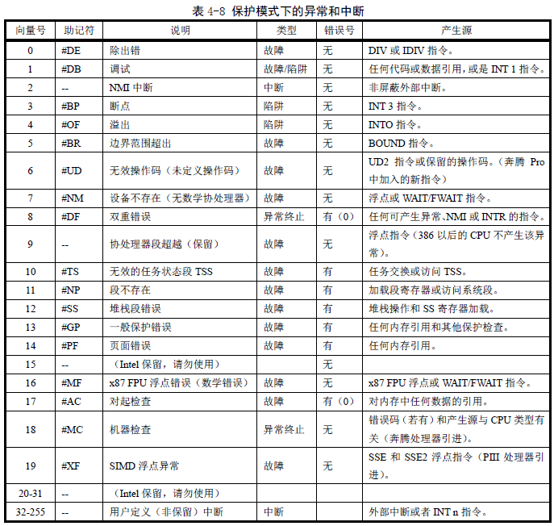
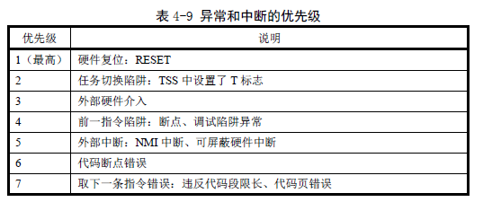
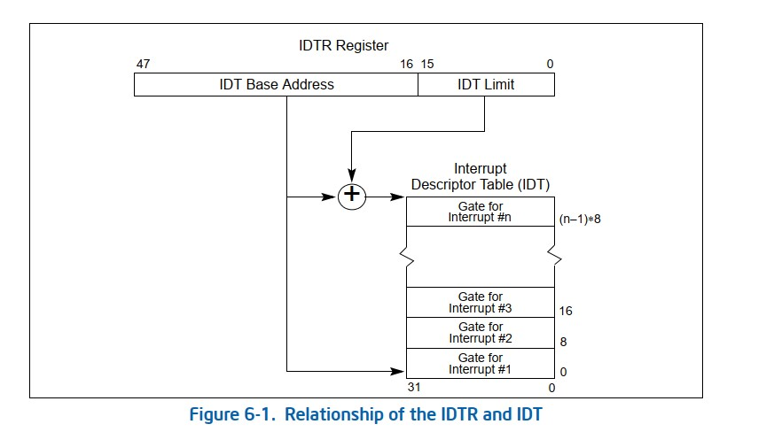
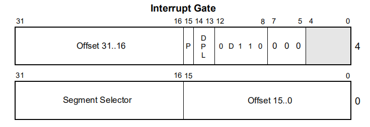
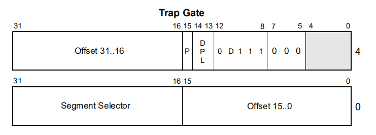
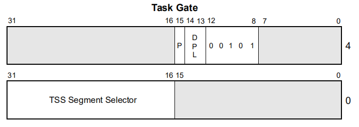
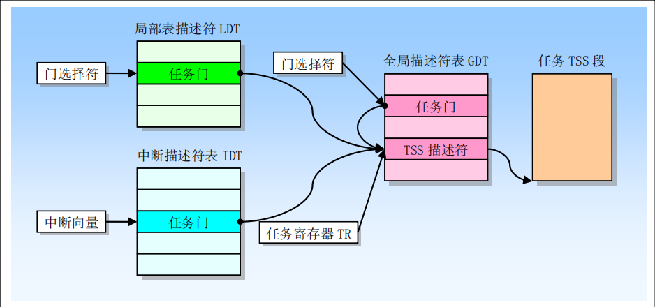

    19-read03

# 3 中断和异常处理
## 3.1 中断和异常处理概述

中断和异常是一种系统的活动，他们用来指示系统、处理器或当前正在执行的程序或任务中的某处出现了一些需要引起处理器注意的特殊状况。它们通常导致执行从当前正在运行的程序或任务，强制转移到称为中断处理程序或异常处理程序的特殊软件例程或任务。处理器响应中断（或异常）而采取的动作称为服务（或处理）中断（或异常）。

### 3.1.1 中断

中断包括硬件中断和软中断。

硬件中断可能会在程序执行的期间随时发生，以响应来自硬件的信号。系统硬件使用中断来处理来自处理器外部的事件，例如处理外围设备的服务请求。硬件中断与处理器的执行并不同步，当中断发生时，处理器要先执行完当前的指令，然后才对中断进行处理。

软中断是由软件通过执行INT n指令来产生的中断，其中n是中断号，也叫做类型码。

### 3.1.2 异常

当处理器在执行一条指令时检测到错误情况的时候就会发生异常，例如被零除的错误。处理器检测各种错误情况，包括违反保护，页面错误和机器内部错误。奔腾4，英特尔至强，P6家族和奔腾处理器的机器检查体系结构还允许在检测到内部硬件错误和总线错误时生成机器检查异常。

异常分为三种。
- 第一种是程序错误异常，指处理器在执行指令的过程中，检测到了程序中的错误，并由此而引发的异常。
- 第二种是软件引发的异常。这类异常通常由into，int3和bound指令主动发起。这些指令允许在指令流的当前点上检查实施异常处理的条件是否满足。举个例子，into指令在执行时，将检查EFLAGS的OF标志，如果满足为1的条件，则引发异常。
- 第三种是机器检查异常。这种异常是处理器型号相关的，也就是说，每种处理器都不太一样。无论如何，处理器提供了一种对硬件芯片内部和总线处理进行检查的机制，当检测到错误是，将引发异常。

根据异常情况的性质和严重性，异常又分为以下三种，并分别实施不同的处理。
- 故障(Faults)。故障通常是可以纠正的，比如，当处理器执行一个访问内存的指令时，发现那个段或者页不在内存中(P = 0)，此时，可以在异常处理程序中予以纠正(分配内存，或者执行磁盘的换入换出操作)，返回时，程序可以重新启动并不失连续性。为了做到这一点，当故障发生时，处理器把机器状态恢复到引起故障的那条指令之前的状态，在进入异常处理程序时，压入栈中的返回地址(CS和EIP的内容)是指向引起故障的那条指令的，而不像通常那样指向下一条指令。如此一来，当中断返回时，将重新执行引起故障的那条指令，而且不再出错(如果引起异常的情况已经妥善处理)。
- 陷阱(Traps)。陷阱中断通常在执行了截获陷阱条件的指令之后立即产生，如果陷阱条件成立的话。陷阱通常用于调试目的，比如单步中断指令int3和溢出检测指令into。陷阱中断允许程序或任务在从中断处理过程返回之后继续进行而不失连续性。因此，当此异常发生时，在转入异常处理程序之前，处理器在栈中压入陷阱截获指令的下一条指令的地址。
- 终止(Aborts)。终止标志着最严重的错误，诸如硬件错误，系统表(GDT，LDT等)中的数据不一致或者无效。这类异常总是无法精确地报告引起错误的指令的位置，在这种错误发生时，程序或者任务不可能重新启动。一个比较典型的终止类异常是"双重故障"(中断号为8)，当发生一次异常之后，处理器在转入该中断的处理程序时，又发生了另外的异常(如该中断处理程序所在的段不在内存中，或者栈溢出)。对于中断处理程序来说，很难从栈中获得有关如何纠正此类错误的明确信息，往往是发生极为重大的错误时才伴随着这种异常，所以在继续执行引起此异常的程序或任务已相当困难，操作系统通常只能把该任务从系统中抹去。

### 3.1.3 处理器如何处理

当接收到中断或检测到异常时，当前正在运行的过程或任务将在处理器执行中断或异常处理程序时挂起。处理程序的执行完成后，处理器将继续执行被中断的过程或任务。除非无法从异常中恢复或中断导致当前正在运行的程序终止，否则恢复被中断的过程或任务的过程不会丢失程序的连续性。

### 3.1.4 在实模式和保护模式下，中断向量表是不一样的

和实模式相比，保护模式下的中断处理有两点最大的区别。首先，中断向量表可以在内存中自由浮动。其次，中断的功能获得了拓展。

在实模式下，中断向量表占据内存最低的1KB，共256个表项。每个表项4子节，包含一个2子节的段地址和2子节的偏移，即中断处理程序的入口地址。但是在保护模式下，中断向量表可以在内存中自由浮动。就像GDT被GDTR指向一样，中断向量表被IDTR（中断描述符表寄存器）指向。该表和GDT非常类似。首先，GDTR和IDTR在格式上完全相同，均包含一个32bit的基地址和16bit的界限。相比之下，CPU中的另外两个关键寄存器LDTR和TR则表现出了相似性，都是16bit大小，分别包含指向LDT和TSS的选择子。从表项上来看，除了指出中断处理程序的目标地址（16bit选择子和32bit偏移）外，IDT表项还为了进行特权级检测而加入的DPL域。此外，IDT表项还包含一个P比特。

实模式下，中断的处理过程很单一。当中断被触发时，CPU保护现场，跳转中断处理程序，执行完毕后恢复现场，继续执行原程序。但是，在保护模式下，中断的处理过程呈现出了多样化。中断处理过程因IDT中的描述符而异，可以分为三类。如果IDT描述符是一个TSS描述符，那么中断会引发任务切换。这种机制使得多任务轮询调度成为可能。如果IDT描述符是一个中断门描述符或者陷阱门描述符，则执行类似于实模式的中断跳转。但是中断门和陷阱门差别不大。

---
## 3.2 有关中断和异常的了解性内容

  中断（Interrupt）和异常（Exception）是指明系统、处理器或当前执行程序（或任务）的某处出现一个事件，该事件需要处理器进行处理。通常，这种事件会导致执行控制被强迫从当前运行程序转移到被称为中断处理程序（interrupt handler）或异常处理程序（exception handler）的特殊软件函数或任务中。处理器响应中断或异常异常所采取的行动被称为中断/异常服务（处理）。

  通常，中断发生在程序执行的随机时刻，以响应硬件发出的信号。系统硬件使用中断来处理外部事件，例如要求为外部设备提供服务。当然，软件也应通过执行INT n指令产生中断。

  对应用程序和操作系统来说，80X86的中断和异常处理机制可以透明的处理发生的中断和异常事件。当收到一个中断或检测到一个异常时，处理器会自动的把当前正在执行的程序或任务挂起，并开始运行中断或异常处理程序。当处理程序执行完毕，处理器会恢复并继续执行被中断的程序或任务。被中断程序的恢复过程并不会失去程序执行的连贯性，除非从异常中恢复是不可能的或者中断导致当前运行程序被终止。接下来介绍保护模式中处理器中断和异常的处理机制。

### 3.2.1 中断和异常向量

  为了有助于处理异常和中断，每个需要被处理器进行特殊处理的处理器定义的异常和中断条件都被赋予了一个标识号，称为向量（vector）。处理器把赋予异常或中断的向量用作描述符表 IDT（Interruption Description Table）中的一个索引号，来定位一个异常或中断的处理程序入口点位置。

  允许的向量号范围是0到255.其中0到31保留用作80X86处理器定义的异常和中断，不过目前该范围内的向量号并非每个都已定义了功能，未定义功能的向量号将留作今后使用。

  范围在32到255的向量号用于用户定义的中断。这些中断通常用于外部I/O设备，使得这些设备可以以通过外部硬件中断机制向处理器发送中断。下表给出了为80X86定义的异常和NMI中断分配的向量。对于每个异常，该表给出了异常类型以及是否会产生一个错误并保存在堆栈上。同时还给出了每个预先定义好的异常和NMI中断源。

### 3.2.2 中断源和异常源

1. 中断源
   
   处理器从两种地方接收中断：
   - 外部（硬件产生）的中断
   - 软件产生的中断
   
   外部中断通过处理器芯片上两个引脚（INTR和NMI）接收。当引脚INTR接收到外部产生的中断信号时，处理器就会从系统总线上读取外部中断控制器（例如8259A）提供的中断向量号。当引脚NMI接收到信号时，就产生一个非屏蔽中断.它使用固定中断向量号2.任何通过处理器INTR引脚接收的外部中断都被称为可屏蔽硬件中断，包括中断向量号0到255。标志寄存器EFLAGS中的IF标志可用来屏蔽所有这些硬件中断。
   
   通过在指令操作数中提供中断向量号，INT n指令可用于从软件中产生中断。例如，指令INT0x80会执行Linux的系统中断调用中断0x80。向量0到255中的任何一个都可以用作INT指令的中断号。然而，如果使用了处理器预先定义的NMI向量，那么处理器对它的响应将与普通方式产生的该NMI中断不同。如果NMI的向量号2用于该INT指令，就会调用NMI的中断处理器程序，但是此时并不会激活处理器的NMI处理硬件。（注意：EFLAGS中的IF标志不能够屏蔽使用INT指令从软件中产生的中断。）

2. 异常源
   
   处理器接收的异常也有来两个来源：
   - 处理器检测到的程序错误异常
   - 软件产生的异常
   
   在应用程序或操作系统执行期间，如果处理器检测到程序错误，就会产生一个或多个异常。80X86处理器为其检测到的每个异常定义了一个向量。异常可以被细分为故障（faults）、陷阱（traps）和中止（aborts）。
   
   指令INTO、INT3和BOUND指令可以用来从软件中产生异常。这些指令可对指令流中指定点执行的特殊异常条件进行检查。例如INT3指令会产生一个断点异常。
   
   INT n指令可用于在软件中模拟指定的异常，但有一个限制。如果INT指令中的操作数n是80X86异常的向量号之一，那么处理器将为该向量号产生一个中断，该中断就会去执行与该向量有关的异常处理程序。但是因为这实际上是一个中断，所以处理器并不会把一个错误号压入堆栈，即使硬件产生的该向量相关的中断通常会产生一个错误码。对于那些会产生错误码的异常，异常的处理程序会试图从堆栈上弹出错误码。因此，如果使用INT指令来模拟产生一个异常，处理器程序则会把EIP（正好处于缺少的错误码位置处）弹出堆栈，从而会造成返回位置错误。

### 3.2.3 异常分类
根据异常被报告的方式以及导致异常的指令是否能够被重新执行，异常被细分为故障、陷阱和中止。

- 故障是一种通常可以被纠正的异常，并且一旦被纠正程序就可以继续运行。当出现一个故障，处理器会把机器状态恢复到产生故障的指令之前的状态。此时异常处理程序的返回地址会指向产生故障的指令，而不是其后面一条指令。因此在返回后产生故障的指令将被重新执行。
- 陷阱是一个引起陷阱的指令被执行后立刻会报告的异常。陷阱也能够让程序或任务连贯的运行。陷阱处理程序的返回地址指向引起陷阱指令的随后一条指令，因此在返回后会执行下一条指令。
- 中止是一种不会总是报告导致异常的指令的精确位置的异常，并且不允许导致异常的程序重新继续执行。中止用于报告严重错误，例如硬件错误以及系统表中存在不一致或非法值。

### 3.2.4 程序或任务的重新执行
为了让程序或任务在一个异常或中断处理完之后能重新恢复执行，除了中止之外的所有异常都能报告精确的指令位置，并且所有中断保证是在指令边界上发生。

对于故障类异常，处理器产生异常时保存的返回指针指向出错指令。因为，当程序或任务在故障处理程序返回后重新开始执行时，原出错指令会被重新执行。重新执行引发出错的指令通常用于处理访问指令操作数受阻的情况。故障最常见的一个例子时页面故障异常。当程序引用不在内存中页面上的一个操作数时就会出现这种异常。当页面故障异常发生时，异常处理程序可以把该页面加载到内存中并通过重新执行错误指令来恢复程序执行。为了确保重新执行对于当前执行程序具有透明性，处理器会保存必要的寄存器和堆栈指针信息，以使得自己能够返回执行到执行出错指令之前的状态。

对于陷阱类异常，处理器产生异常时保存的返回指针指向引起陷阱操作的后一条指令。如果在一条执行控制转移的指令执行期间检测到一个陷阱，则返回指令指针会反映出控制的转移情况。例如，如果在执行JMP指令时检测到一个陷阱异常，那么返回指针会执行JMP指令的目标位置，而非指向JMP指令的随后的一条指令。

中止类异常不支持可靠的重新执行程序或任务。中止异常的处理程序通常用来收集异常发生时有关处理器状态的诊断信息，并且尽可能恰当的关闭程序和系统。

中断会严格地支持被中断程序的重新执行而不会丢失任何连贯性。中断所保存的返回指令指针指向处理器获取中断时将要执行的下一条指令边界处。如果刚执行的指令有一个重复前缀，则中断会在当前重复结束并且寄存器已为下一次重复此操作设置好时发生。

### 3.2.5 开启和禁止中断
标志寄存器EFLAGS的中断允许标志IF能够禁止为处理器INTR引脚上收到的可屏蔽硬件中断提供服务。当IF=0时，处理器禁止发送到INTR引脚的中断；当IF=1时，则发送到INTR引脚的中断信号被处理器进行处理。

IF标志并不影响发送到NMI引脚的非屏蔽中断，也不影响处理器产生的异常。如同EFLAGS中的其他标志一样，处理器在响应硬件复位操作时会清楚IF标志（IF=0）。

IF标志可以使用指令STI和CLI来设置或清除。只有当程序的CPL<=IOPL时才可执行这两条指令，否则将引发一般保护性异常。IF标志也会受以下操作影响：

- PUSHF指令会把EFLAGS内容存入堆栈中，并且可以在那里被修改。而POPF指令可用于把已被修改的标志内容放入EFLAGS寄存器中。
- 任务切换、POPF和IRET指令会加载EFLAGS寄存器。因此，他们可用来修改IF标志。
- 当通过中断门处理一个中断时，IF标志会被自动清除（复位），从而会禁止可屏蔽硬件中断。但如果是通过陷阱门来处理了一个中断，则IF标志不会被复位。

### 3.2.6 异常和中断的优先级
如果在一条指令边界有多个异常或中断等待处理时，处理器会按照规定的次序对他们进行处理。下表给出了异常和中断源类的优先级。处理器会首先处理最好优先级中的异常或中断。低优先级的异常会被丢弃，而低优先级的中断则会保持等待。当中断处理程序返回产生异常和/或中断的程序或任务时，被丢弃的异常会重新发生。

---
## 3.3 中断描述符表
### 3.3.1 中断描述符表的构成

中断描述符表将每个异常或中断向量与处理相关异常或中断任务的门描述符相关联。在保护模式下，中段描述符表(IDT)是一个储存8字节长度的描述符表项的数组。其中，每个表项也叫做一个门描述符。

因为最多只有256个异常或者中断向量，所以，IDT表最多只需要包含256个门描述符。如果有空的门描述符（不满256个），则需要将每个空的门描述符对应的present标志置为0 。

IDT的基址，应当以8字节对齐，以最大限度的利用缓存(cache)的填充能力。IDTR寄存器中，有相关的限制值字段，以字节为单位，用于描述IDT表中最后一个有效位字节的地址（偏移量）。例如当限制值为0，说明IDT表中有1个有效字节，但是实际上，这个限制值往往是以8N-1为单位的，因为一个门描述符长度为8字节。

IDT表可以位于线性地址空间的任何位置，通常由IDTR寄存器来定位IDT表的位置，IDTR寄存器由32位的基址和16位的限制值组成。

门描述符的结构将会在3.4中介绍。

### 3.3.2 获得中断处理程序的地址

IDT表中的每个门描述符中记录着每个中断处理程序的入口地址。当生成中断向量时，根据中断描述符表查询该中断向量对应的中断描述符表`中的门描述符，获取门描述符中的存储的中断处理程序的入口地址。

### 3.3.3 设置中断描述符表寄存器

LIDT（加载IDT寄存器）和SIDT（存储IDT寄存器）指令分别加载和存储IDTR寄存器的内容。LIDT指令用内存操作数中的基址和限制值加载IDTR寄存器。此指令只能在CPL为0时执行。它通常由操作系统的初始化代码在创建IDT时使用。操作系统也可以使用它从一个IDT更改为另一个IDT。SIDT指令将IDTR中存储的基值和限制值复制到内存中。此指令可以在任何特权级别执行。

如果向量引用的描述符超出IDT的限制，则会生成一般保护异常（#GP）。

---
## 3.4 IDT 描述符

在保护模式下，中断描述符表（IDT）中的每个表项由8个字节组成，其中的每个表项叫做一个门描述符（Gate Descriptor）， “门”的含义是指当中断发生时必须先访问这些“门”，能够“开门”（即将要进行的处理需通过特权检查，符合设定的权限等约束）后，然后才能进入相应的处理程序。而门描述符则描述了“门”的属性（如特权级、段内偏移量等）。在IDT中，可以包含如下3种类型的系统段描述符：

- 中断门

  

- 陷阱门

  

- 任务门

  
  
  - Offset：过程入口点偏移地址（High：16bit ，Low：16bit）；
  - P：段存在标志（1 bit），为1表示在内存中；
  - DPL ： 描述符特权级（3 bit）；
  - D标志位：1=32位，0=16位；
  - 类型码：110：中断门，111：陷阱门，100，调用门；
  - 阴影部分表示空闲不用；
  - Segment Selector：段选择符；
  - TSS Segment Selector：TSS段选择符。

备注：任务门描述符（Task gate descriptor）提供对一个任务间接、受保护地的引用，任务门描述符可以被存放在 GDT、LDT 或 IDT 表中。任务门描述符中的 TSS 选择符字段指向 GDT 中的一个 TSS 段描述符。这个 TSS 选择符字段中的 RPL域不用。任务门描述符中的 DPL 用于在任务切换时控制对 TSS 段的访问。当程序通过任务门调用或跳转到一个任务时，程序的CPL以及指向任务门的门选择符的RPL值必须小于或等于任务门描述符中的DPL。请注意，当使用任务门时，目标 TSS 段描述符的 DPL 忽略不用。

程序可以通过任务门描述符或者 TSS 段描述符来访问一个任务。下图展示出了 LDT、GDT 和 IDT 表中的任务门如何都指向同一个任务。

中断门和陷阱门在使用上的区别不在于中断是外部产生的还是有CPU本身产生的，而在于通过中断门进入中断服务程序时CPU会自动将中断关闭（将EFLAGS寄存器中IF标志位置0），以防止嵌套中断产生，而通过陷阱门进入服务程序时则维持IF标志位不变。这是二者唯一的区别。

---
##  3.5 中断与异常处理
###  3.5.1 中断过程调用的流程是怎样的？
一般中断处理的主要步骤分别是中断请求中断判优、中断响应、中断处理和中断返回。

在微机系统中，对于外部中断，中断请求信号是由外部设备产生，并施加到CPU的NMI或INTR引脚上，CPU通过不断地检测NMI和INTR引脚信号来识 别是否有中断请求发生。对于内部中断，中断请求方式不需要外部施加信号激发，而是通过内部中断控制逻辑去调用。无论是外部中断还是内部中断，中断处理过程 都要经历以下步骤：　请求中断→响应中断→关闭中断→保留断点→中断源识别→保护现场→中断服务子程序→恢复现场→中断返回。
- 请求中断
   
  当某一中断源需要CPU为其进行中断服务时，就输出中断请求信号，使中断控制系统的中断请求触发器置位，向CPU请求中断。系统要求中断请求信号一直保持到CPU对其进行中断响应为止。
- 中断响应
   
  CPU对系统内部中断源提出的中断请求必须响应，而且自动取得中断服务子程序的入口地址，执行中断 服务子程序。对于外部中断，CPU在执行当前指令的最后一个时钟周期去查询INTR引脚，若查询到中断请求信号有效，同时在系统开中断（即IF=1）的情 况下，CPU向发出中断请求的外设回送一个低电平有效的中断应答信号，作为对中断请求INTR的应答，系统自动进入中断响应周期。
- 关闭中断
   
  CPU响应中断后，输出中断响应信号，自动将状态标志寄存器FR或EFR的内容压入堆栈保护起来，然后将FR或EFR中的中断标志位IF与陷阱标志位TF清零，从而自动关闭外部硬件中断。因为CPU刚进入中断时要保护现场，主要涉及堆栈操作，此时不能再响应中断，否则将造成系统混乱。
- 保护断点
   
  保护断点就是将CS和IP/EIP的当前内容压入堆栈保存，以便中断处理完毕后能返回被中断的原程序继续执行，这一过程也是由CPU自动完成。
- 中断源识别
   
  当系统中有多个中断源时，一旦有中断请求，CPU必须确定是哪一个中断源提出的中断请求，并由中断控制器给出中断服务子程序的入口地址，装入CS与IP/EIP两个寄存器。CPU转入相应的中断服务子程序开始执行。
- 保护现场
　 
  主程序和中断服务子程序都要使用CPU内部寄存器等资源，为使中断处理程序不破坏主程序中寄存器的内容，应先将断点处各寄存器的内容压入堆栈保护起来，再进入的中断处理。现场保护是由用户使用PUSH指令来实现的。

### 3.5.2 如何判断中断处理过程与被中断任务的优先级？
为使系统能及时响应并处理发生的所有中断，系统根据引起中断事件的重要性和紧迫程度，硬件将中断源分为若干个级别，称作中断优先级。

在实际系统中，常常遇到多个中断源同时请求中断的情况，这时CPU必须确定首先为哪一个中断源服务，以及服务的次序。解决的方法是中断优先排队，即根据中断源请求的轻重缓急，排好中断处理的优先次序即优先级，又称优先权，先响应优先级最高的中断请求。另外，当CPU正在处理某一中断时，要能响应另一个优先级更高的中断请求，而屏蔽掉同级或较低级的中断请求，形成中断嵌套。

在实际系统中，常常遇到多个中断源同时请求中断的情况，这时CPU必须确定首先为哪一个中断源服务，以及服务的次序。解决的方法是中断优先排队，即根据中断源请求的轻重缓急，排好中断处理的优先次序即优先级( Priority)，又称优先权，先响应优先级最高的中断请求。另外，当CPU正在处理某一中断时，要能响应另一个优先级更高的中断请求，而屏蔽掉同级或较低级的中断请求，形成中断嵌套。
中断源的优先级判别一般可采用软件优先级排队和硬件优先级排队两种方法。 
- 软件优先级排队
   
  优先级由查询顺序决定，先查询的中断源具有最高的优先级。软件优先级排队是指各个中断源的优先权由软件安排。若干个外设的中断请求信号相“或”后，送至CPU的中断接收引脚(如INTR)。这样，只要任一外设有中断请求，CPU便可响应中断。在中断服务子程序前可安排一段优先级的查询程序，即CPU读取外设中断请求状态端口，然后根据预先确定的优先级级别逐位检测各外设的状态，若有中断请求就转到相应的Uo处理程序入口，为该外设服务。用软件査询方法确定中断优先级是一种最简单的解决方法，主要依靠软件方法实现，不需要专门的优先级排队电路，可以通过修改查询顺序来修改中断优先级，不必更改硬件。但是当中断源个数较多时，由逐位检测査询到转入相应中断服务程序所耗费的时间较长，中断响应速度慢，服务效率低。
- 硬件优先级排队
   
  为提高中断处理效率，通常采用硬件处理中断优先权问题，即采用优先级排队电路或专用中断控制器等硬件电路来管理中断。其中，硬件优先权排队电路形式众多，有采用编码器组成的，有采用链式电路的。利用外设连接在排队电路的物理位置来决定其中断优先权的，排在最前面的优先级最高，排在最后面的优先级最低。

### 3.5.3 不同优先级上，处理方式一样吗？
响应不同优先级中断的原则是：
- CPU首先响应高优先级的中断请求；
- 如果优先级相同，CPU按查询次序响应排在前面的中断；
- 正在进行的中断过程不能被新的同级或低优先级的中断请求所中断；
- 正在进行的低优先级中断过程，能被高优先级中断请求所中断。

### 3.5.4 如果发生堆栈切换，处理器会做哪些操作？
- 处理器从当前执行任务的TSS段中得到中断或异常处理过程使用的堆栈的段选择符和栈指针。然后处理器会把被中断程序(或任务)的栈选择符和栈指针压入新栈中。
- 接着处理器会吧EFLAFS、CS和EIP寄存器的当前值也压入新栈中。
- 如果异常会产生一个错误号，那么该错误号也会被最后压入新栈中。

### 3.5.5 如果没发生堆栈切换，处理器会做哪些操作？
处理器会把EFLAGS、CS和EIP寄存器的当前值保存在当前堆栈上。

### 3.5.6 中断处理过程后，如何返回，处理器做了哪些操作？
1. 保存现场
系统开辟现场区，并将现场区组织成“栈”结构，当中断响应时，(1)硬件结构自动将PS和PC寄存器的内容压入栈中作为现场信息保存起来。(2)根据发生的中断，硬件从指定的中断向量单元中取出PS和PC内容，分别装入PS和PC寄存器，同时正确填入寄存器的“当前状态”和“先前状态”字段。

2. 分析原因，转中断处理程序
不同原因产生的中断事件要进行不同的处理，根据中断的路寄存器内容得出发生该种中断的具体原因。转入相对应的中断处理程序运行。

3. 恢复现场
在多级中断系统中，考虑退回当前中断时，必须依据原先被中断的程序，完成不同的工作，中断处理结束后，软件必须退出中断。如果此次是高级中断，并且被中断的程序是一个低级中断处理程序，则此次中断应返回到该低级中断处理程序。如果原来被中断的是用户程序，则退出中断前应先考虑进行一次调度选择，以挑选出更适合在当前情况下运行的新程序。

### 3.5.7 异常和中断处理过程的保护
异常和中断处理过程的特权级保护机制与通过调用门调用普通过程类似。处理器不允许把控制转移到比CPL更低特权级代码段的中断处理过程中，否则将产生一个一般保护性异常。另外中断和异常的保护机制在一下方面与一般调用门过程不同：
- 因为中断和异常向量没有RPL，因此在隐式调用异常和中断处理过程时不会检查RPl。
- 只有当一个异常或中断时利用INT n、INT 3 或INTO指令产生时，处理器才会检查中断或陷阱门中的DPL。此时CPL必须小于等于们的DPL。这个限制可以防止运行在特权级3的应用程序使用软件中断访问重要的异常处理过程，例如页错误处理过程，假设这些处理过程已被存放在更高特权级的代码段中。对于硬件产生的中断和处理器检测到的异常，处理器会忽略中断门和陷阱门中的DPL。 因为异常和中断通常不会定期发生。这个技术可以用于只需已访问堆栈上的数据的处理过程。如果处理程序需要数据段中的数据，那么特权级 3 必须能够访问这个数据段，但这样就没保护可言了。
- 处理过程可以放在具有特权级 0 的非一致代码段中。这种处理过程总是可以执行的，而不管被中断程序或任务的当前特权级CPl。
  
### 3.5.8 异常和中断处理过程的标志使用方式
当通过中断门或陷阱门访问一个异常或中断处理过程，处理器会在把EFLAGS寄存器内容保存到堆栈上之后清除EFLAGS中的TF标志。清除TF标志可以防止指令跟踪影响中断响应。而随后的IRET指令会用堆栈上的内容恢复EFLAGS的原TF标志。

### 3.5.9 中断门与陷阱门的唯一区别是什么？
中断门与陷阱门唯一的区别在于处理器操作EFLAGS寄存器TF标志的方法。当通过中断门访问一个异常或中断处理过程时，处理器会复位TF标志以防止其他中断干扰当前中断处理过程。随后IRET指令则会用保存在堆栈上的内容恢复EFLAGS寄存器的TF标志，而通过陷阱门访问处理过程并不会影响TF标志位。