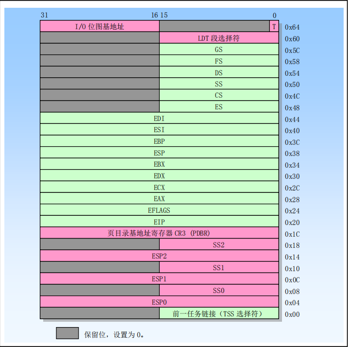

    19-read04

# 4 任务管理

## 4.1任务管理概述

* 任务（Task）是处理器可以分配调度、执行和挂起的一个工作单元。它可用于执行程序、任务或进程、操作系统服务、中断或异常处理过程和内核代码。80X86 提供了一种机制，这种机制可用来保存任务的状态、分派任务执行以及从一个任务切换到另一 个任务。当工作在保护模式下，处理器所有运行都在任务中。即使是简单系统也必须起码定义一个任务。 更为复杂的系统可以使用处理器的任务管理功能来支持多任务应用。
* 80X86 提供了多任务的硬件支持。任务是一个正在运行的程序，或者是一个等待准备运行的程序。通过中断、异常、跳转或调用，我们可以执行一个任务。当这些控制转移形式之一和某个描述符表中指定项 的内容一起使用时，那么这个描述符就是一类导致新任务开始执行的描述符。
* 描述符表中与任务相关的描述符有两类：任务状态段描述符和任务门。当执行权传给这任何一类描述符时，都会造成任务切换。
* 任务切换很象过程调用，但任务切换会保存更多的处理器状态信息。任务切换会把控制权完全转移到一个新的执行环境，即新任务的执行环境。这种转移操作要求保存处理器中几乎所有寄存器的当前内容，包括标志寄存器 EFLAGS 和所有段寄存器。与过程不同，任务不可重入。任务切换不会把任何信息压入堆栈中，处理器的状态信息都被保存在内存中称为任务状态段（Task state segment）的数据结构中。

### 4.1.1任务的结构
* 一个任务由两部分构成：任务执行空间和任务状态段 TSS（Task-state segment）。
* 任务执行空间包括代码段、堆栈段和一个或多个数据段，见下图。

* 如果操作系统使用了处理器的特权级保护机制，那么任务执行空间就需要为每个特权级提供一个独立的堆栈空间。TSS 指定了构成任务执行空间的各个段，并且为任务状态信息提供存储空间。在多任务环境中，TSS 也为任务之间的链接提供了处理方法。

### 4.1.2 任务的状态

* 当前正在执行的任务状态包括哪些内容
  
  以下项目定义了正在执行的任务的状态：
    * 任务的当前执行空间，由段寄存器中的段选择器定义（CS、DS、SS、ES、FS和GS）
    * 通用目的寄存器的状态
    * EFLAGS寄存器的状态
    * EIP寄存器的状态
    * 控制寄存器CR3的状态
    * 任务寄存器的状态
    * LDTR寄存器的状态
    * I/O映射基地址和I/O映射（包含在TSS中）
    * 指向特权0、1和2堆栈（包含在TSS中）的堆栈指针
    * 链接到先前执行的任务（包含在TSS中）

    在分派任务之前，所有这些项都包含在任务的TSS中，任务寄存器的状态除外。此外，LDTR寄存器的完整内容不包含在TSS中，只有LDT的段选择器。

* 掌握每一个被包含内容的含义
    
  段选择器定义了任务当前的执行空间，即任务正在使用的段信息。通用寄存器保存了当前任务所存储的寄存器数据信息。标志寄存器定义了程序当前的状态和控制信息。eip寄存器则指明了当前程序执行代码段的偏移量。控制寄存器指明了当前系统的模式信息，LDTR寄存器则保留了当前程序的局部描述符表信息，其余的映射和特权级则保留了当前程序的IO信息和特信息。

* 为什么要包含这些内容

  这些内容指明了当前正在运行程序的所有状态信息，拥有了这些信息，就能够完整的还原当前程序的运行状态。这在后续的任务切换中，如何保存和还原被切换的任务中是需要考虑的。

### 4.1.3任务的执行

* 软件或处理器可以使用以下方法之一来调度执行一个任务： 
  * 使用 CALL 指令明确地调用一个任务； 
  * 使用 JMP 指令明确地跳转到一个任务（Linux 内核使用的方式）； 
  * （由处理器）隐含地调用一个中断句柄处理任务； 
  * 隐含地调用一个异常句柄处理任务；  

* 所有这些调度任务执行的方法都会使用一个指向任务门或任务 TSS 段的选择符来确定一个任务。当使用 CALL 或 JMP 指令调度一个任务时，指令中的选择符既可以直接选择任务的 TSS，也可以选择存放有 TSS 选择符的任务门。当调度一个任务来处理一个中断或异常时，那么 IDT 中该中断或异常表项必须是一 个任务门，并且其中含有中断或异常处理任务的 TSS 选择符。 
* 当调度一个任务执行时，当前正在运行任务和调度任务之间会自动地发生任务切换操作。在任务切换期间，当前运行任务的执行环境（称为任务的状态或上下文）会被保存到它的 TSS 中并且暂停该任务的执 行。此后新调度任务的上下文会被加载进处理器中，并且从加载的 EIP 指向的指令处开始执行新任务。 
* 如果当前执行任务（调用者）调用了被调度的新任务（被调用者），那么调用者的 TSS 段选择符会被 保存在被调用者 TSS 中，从而提供了一个返回调用者的链接。对于所有 80X86 处理器，任务是不可递归 调用的，即任务不能调用或跳转到自己。  
* 中断或异常可以通过切换到一个任务来进行处理。在这种情况下，处理器不仅能够执行任务切换来处理中断或异常，而且也会在中断或异常处理任务返回时自动地切换回被中断的任务中去。这种操作方式可以处理在中断任务执行时发生的中断。 
* 作为任务切换操作的一部份，处理器也会切换到另一个 LDT，从而允许每个任务对基于 LDT 的段具有不同逻辑到物理地址的映射。同时，页目录寄存器 CR3 也会在切换时被重新加载，因此每个任务可以有自己的一套页表。这些保护措施能够用来隔绝各个任务并且防止它们相互干扰。 
* 使用处理器的任务管理功能来处理多任务应用是任选的。我们也可以使用软件来实现多任务，使得每个软件定义的任务在一个 80X86 体系结构的任务上下文中执行。
* linux0.00使用了中断切换任务

---
## 4.2. 任务的数据结构

### 4.2.1 任务状态段 Task-State Segment (TSS)
用于恢复一个任务执行的处理器状态信息被保存在称为任务状态段 TSS（Task state segment）的段中。下图给出了 32 位 CPU 使用的 TSS 的格式。TSS 段中各字段可分成两大类：动态字段和静态字段。

* 动态字段。当任务切换而被挂起时，处理器会更新动态字段的内容。这些字段包括：
  * 通用寄存器字段。用于保存 EAX、ECX、EDX、EBX、ESP、EBP、ESI 和 EDI 寄存器的内容。
  * 段选择符字段。用于保存 ES、CS、SS、DS、FS 和 GS 段寄存器的内容。
  * 标志寄存器 EFLAGS 字段。在切换之前保存 EFLAGS。
  * 指令指针 EIP 字段。在切换之前保存 EIP 寄存器内容。
  * 先前任务连接字段。含有前一个任务 TSS 段选择符（在调用、中断或异常激发的任务切换时更新）。该字段（通常也称为后连接字段（Back link field））允许任务使用 IRET 指令切换到前一个任务。

* 静态字段。处理器会读取静态字段的内容，但通常不会改变它们。这些字段内容是在任务被创建时设置的。这些字段有：
  * LDT 段选择符字段。含有任务的 LDT 段的选择符。
  * CR3 控制寄存器字段。含有任务使用的页目录物理基地址。控制寄存器 CR3 通常也被称为页目录基地址寄存器 PDBR（Page directory base register）。
  * 特权级 0、1 和 2 的堆栈指针字段。这些堆栈指针由堆栈段选择符（SS0、SS1 和 SS2）和栈中偏移量指针（ESP0、ESP1 和 ESP2）组成。注意，对于指定的一个任务，这些字段的值是不变的。因此，如果任务中发生堆栈切换，寄存器 SS 和 ESP 的内容将会改变。
  * 调试陷阱（Debug Trap）T 标志字段。该字段位于字节 0x64 比特 0 处。当设置了该位时，处理器切换到该任务的操作将产生一个调试异常。
  * I/O 位图基地址字段。该字段含有从 TSS 段开始处到 I/O 许可位图处的 16 位偏移值。

* 如果使用了分页机制，那么在任务切换期间应该避免处理器操作的 TSS 段中（前 104 字节中）含有内存页边界。   如果 TSS 这部分包含内存页边界，那么该边界处两边的页面都必须同时并且连续存在于内存中。
* 另外，如果使用了分页机制，那么与原任务 TSS 和新任务 TSS 相关的页面，以及对应的描述符表表项应该是可读写的。

### 4.2.2 TSS描述符

与其他段一样，任务状态段 TSS 也是使用段描述符来定义。下图给出了 TSS 描述符的格式。TSS
描述符只能存放在 GDT 中。

* 类型字段 TYPE 中的忙标志 B 用于指明任务是否处于忙状态。忙状态的任务是当前正在执行的任务或
等待执行（被挂起）的任务。值为 0b1001 的类型字段表明任务处于非活动状态；而值为 0b1011 的类型字
段表示任务正忙。任务是不可以递归执行的，因此处理器使用忙标志 B 来检测任何企图对被中断执行任务
的调用。
* 其中基地址、段限长、描述符特权级 DPL、颗粒度 G 和存在位具有与数据段描述符中相应字段同样的
功能。当 G=0 时，限长字段必须具有等于或大于 103（0x67）的值，即 TSS 段的最小长度不得小于 104 字
节。如果 TSS 段中还包含 I/O 许可位图，那么 TSS 段长度需要大一些。另外，如果操作系统还想在 TSS
段中存放其他一些信息，那么 TSS 段就需要更大的长度。
* 使用调用或跳转指令，任何可以访问 TSS 描述符的程序都能够造成任务切换。可以访问 TSS 描述符
的程序其 CPL 数值必须小于或等于 TSS 描述符的 DPL。在大多数系统中，TSS 描述符的 DPL 字段值应该
设置成小于 3。这样，只有具有特权级的软件可以执行任务切换操作。然而在多任务应用中，某些 TSS 的
DPL 可以设置成 3，以使得在用户特权级上也能进行任务切换操作。
* 可访问一个 TSS 段描述符并没有给程序读写该描述符的能力。若想读或修改一个 TSS 段描述符，可
以使用映射到内存相同位置的数据段描述符（即别名描述符）来操作。把 TSS 描述符加载进任何段寄存器
将导致一个异常。企图使用 TI 标志置位的选择符（即当前 LDT 中的选择符）来访问 TSS 段也将导致异常。

### 4.2.3 任务寄存器

* 任务寄存器 TR（Task Register）中存放着 16 位的段选择符以及当前任务 TSS 段的整个描述符（不可
见部分）。这些信息是从 GDT 中当前任务的 TSS 描述符中复制过来的。处理器使用任务寄存器 TR 的不可
见部分来缓冲 TSS 段描述符内容。
* 指令 LTR 和 STR 分别用于加载和保存任务寄存器的可见部分，即 TSS 段的选择符。LTR 指令只能被
特权级 0 的程序执行。LTR 指令通常用于系统初始化期间给 TR 寄存器加载初值（例如，任务 0 的 TSS 段
选择符），随后在系统运行期间，TR 的内容会在任务切换时自动地被改变。

### 4.2.4 任务门描述符 Task-Gate Descriptor

* 任务门描述符（Task gate descriptor）提供对一个任务间接、受保护地的引用，其格式见图所示。任务
门描述符可以被存放在 GDT、LDT 或 IDT 表中。
* 任务门描述符中的 TSS 选择符字段指向 GDT 中的一个 TSS 段描述符。这个 TSS 选择符字段中的 RPL
域不用。任务门描述符中的 DPL 用于在任务切换时控制对 TSS 段的访问。当程序通过任务门调用或跳转
到一个任务时，程序的CPL以及指向任务门的门选择符的RPL值必须小于或等于任务门描述符中的DPL。
* 请注意，当使用任务门时，目标 TSS 段描述符的 DPL 忽略不用。
* 程序可以通过任务门描述符或者 TSS 段描述符来访问一个任务。下图示出了 LDT、GDT 和 IDT 表
中的任务门如何都指向同一个任务。

---
## 4.3任务切换

### 4.3.1何时发生任务切换

* 处理器可使用一下 4 种方式之一执行任务切换操作： 
  1. 当前任务对 GDT 中的 TSS 描述符执行 JMP 或 CALL 指令； 
  2.  当前任务对 GDT 或 LDT 中的任务门描述符执行 JMP 或 CALL 指令；
  3. 中断或异常向量指向 IDT 表中的任务门描述符；
  4. 当 EFLAGS 中的 NT 标志置位时当前任务执行 IRET 指令。   

* JMP、CALL 和 IRET 指令以及中断和异常都是处理器的普通机制，可用于不发生任务切换的环境中。 对于 TSS 描述符或任务门的引用（当调用或跳转到一个任务），或者 NT 标志的状态（当执行 IRET 指令时） 确定了是否会发生任务切换。

* 为了进行任务切换，JMP 或 CALL 指令能够把控制转移到 TSS 描述符或任务门上。使用这两种方式的作用相同，都会导致处理器把控制转移到指定的任务中，如下图所示。 

### 4.3.2发生任务切换，处理器执行的操作

* 当切换到一个新任务时，处理器会执行一下操作： 
  1. 从作为 JMP 或 CALL 指令操作数中，或者从任务门中，或者从当前 TSS 的前一任务链接字段（对 于由 IRET 引起的任务切换）中取得新任务的 TSS 段选择符。 
  2. 检查当前任务是否允许切换到新任务。把数据访问特权级规则应用到 JMP 和 CALL 指令上。当前 任务的 CPL 和新任务段选择符的 RPL 必须小于或等于 TSS 段描述符的 DPL，或者引用的是一个 任务门。无论目标任务门或 TSS 段描述符的 DPL 是何值，异常、中断（除了使用 INT n 指令产生 的中断）和 IRET 指令都允许执行任务切换。对于 INT n 指令产生的中断将检查 DPL。 
  3. 检查新任务的 TSS 描述符是标注为存在的（P=1），并且 TSS 段长度有效（大于 0x67）。当试图执 行会产生错误的指令时，都会恢复对处理器状态的任何改变。这使得异常处理过程的返回地址指 向出错指令，而非出错指令随后的一条指令。因此异常处理过程可以处理出错条件并且重新执行 任务。异常处理过程的介入处理对应用程序来说是完全透明的。
  4. 如果任务切换产生自 JMP 或 IRET 指令，处理器就会把当前任务（老任务）TSS 描述符中的忙标志 B 复位；如果任务切换是由 CALL 指令、异常或中断产生，则忙标志 B 不动。
  5. 如果任务切换由 IRET 产生，则处理器会把临时保存的 EFLAGS 映像中的 NT 标志复位；如果任 务切换由 CALL、JMP 指令或者异常或中断产生，则不用改动上述 NT 标志。
  6. 把当前任务的状态保存到当前任务的 TSS 中。处理器会从任务寄存器中取得当前任务 TSS 的基地 址，并且把一下寄存器内容复制到当前 TSS 中：所有通用寄存器、段寄存器中的段选择符、标志 寄存器 EFLAGS 以及指令指针 EIP。
  7. 如果任务切换是由 CALL 指令、异常或中断产生，则处理器就会把从新任务中加载的 EFLAGS 中 的 NT 标志置位。如果任务切换产生自 JMP 或 IRET 指令，就不改动新加载 EFLAGS 中的标志。
  8. 如果任务切换由 CALL、JMP 指令或者异常或中断产生，处理器就会设置新任务 TSS 描述符中的 忙标志 B。如果任务切换由 IRET 产生，则不去改动 B 标志。
  9. 使用新任务 TSS 的段选择符和描述符加载任务寄存器 TR（包括隐藏部分）。设置 CR0 寄存器的 TS 标志。
  10. 把新任务的 TSS 状态加载进处理器。这包括 LDTR 寄存器、PDBR（CR3）寄存器、EFLAGS 寄 存器、EIP 寄存器以及通用寄存器和段选择符。在此期间检测到的任何错误都将出现在新任务的 上下文中。
  11. 开始执行新任务（对于异常处理过程，新任务的第一条指令显现出还没有执行）。 

* 当成功地进行了任务切换操作，当前执行任务的状态总是会被保存起来。当任务恢复执行时，任务将从保存的 EIP 指向的指令处开始执行，并且所有寄存器都恢复到任务挂起时的值。 
* 当执行任务切换时，新任务的特权级与原任务的特权级没有任何关系。新任务在 CS 寄存器的 CPL 字段指定的特权级上开始运行。因为各个任务通过它们独立的地址空间和 TSS 段相互隔绝，并且特权级规则已经控制对 TSS 的访问，所以在任务切换时软件不需要再进行特权级检查。 
* 每次任务切换都会设置控制寄存器 CR0 中的任务切换标志 TS。该标志对系统软件非常有用。系统软件可用 TS 标志来协调处理器和浮点协处理器之间的操作。TS 标志表明协处理器中的上下文可能与当前任务的不一致。

### 4.3.3中断或异常向量指向 `IDT` 表中的中断门或陷阱门，会发生任务切换吗？

* 当中断或异常的向量索引的是 IDT 中的一个任务门时，一个中断或异常就会造成任务切换。如果向量索引的是 IDT 中的一个中断或陷阱门，则不会造成任务切换。 
* 中断服务过程总是把执行权返回到被中断的过程中，被中断的过程可能在另一个任务中。如果 NT 标 志处于复位状态，则执行一般返回处理。如果 NT 标志是置位状态，则返回操作会产生任务切换。切换到 的新任务由中断服务过程 TSS 中的 TSS 选择符（前一任务链接字段）指定。

---
## 4.4任务链

### 4.4.1如何判断任务是否嵌套，何时会嵌套

* TSS 的前一任务连接（Backlink）字段以及 EFLAGS 中的 NT 标志用于返回到前一个任务操作中。NT 标志指出了当前执行的任务是否是嵌套在另一个任务中执行，并且当前任务的前一任务连接字段中存放着嵌套层中更高层任务的 TSS 选择符，若有的话（见下图所示）。 

 

* 注意，当任务切换是由 JMP 指令造成，那么新任务就不会是嵌套的。也即，NT 标志会被设置为 0， 并且不使用前一任务链接字段。JMP 指令用于不希望出现嵌套的任务切换中。 

### 4.4.2任务嵌套修改的标志位

* 下表总结了任务切换期间，忙标志 B（在 TSS 段描述符中）、NT 标志、前一任务链接字段和 TS 标志（在 CR0 中）的用法。注意，运行于任何特权级上的程序都可以修改 NT 标志，因此任何程序都可以设置NT标志并执行IRET指令。这种做法会让处理器去执行当前任务TSS的前一任务链接字段指定的任务。 为了避免这种伪造的任务切换执行成功，操作系统应该把每个 TSS 的该字段初始化为 0。 

### 4.4.3任务嵌套时如何返回前一任务

* 当 CALL 指令、中断或异常造成任务切换，处理器把当前 TSS 段的选择符复制到新任务 TSS 段的前一任务链接字段中，然后在 EFLAGS 中设置 NT 标志。NT 标志指明 TSS 的前一任务链接字段中存放有保 存的 TSS 段选择符。如果软件使用 IRET 指令挂起新任务，处理器就会使用前一任务链接字段中值和 NT 标志返回到前一个任务。也即如果 NT 标志是置位的话，处理器会切换到前一任务链接字段指定的任务去执行。

---
## 4.5 任务地址空间

### 4.5.1 什么是任务地址空间

任务的地址空间由任务可以访问的段组成。

### 4.5.2 任务地址空间包括什么

* 这些段，包含TSS引用到的代码，数据，堆栈，系统段，以及该任务代码能够访问到的其他段组成。
* 这些段被映射到处理器的线性地址空间，而线性地址空间又被映射到处理器的物理地址空间（直接或通过分页）。
* TSS中的LDT段，可以为任务提供他自己的LDT。每个任务拥有自己的LDT，通过在每个任务的LDT表中存储与该任务相关联的所有段的段描述符，可以使得该任务的任务地址空间与其他任务的任务隔离开来。
* 多个任务也可以使用同一LDT。这是一种内存高效的方式，允许特定任务相互通信或控制，而不会降低整个系统的保护屏障。
* 因为所有任务都能够访问GDT表，所以，也可以通过在每个任务自己的LDT中创建相应的描述符去访问。
* 如果启用了分页，则TSS中的CR3 register（PDBR）字段允许每个任务有自己的一组页表，用于将线性地址映射到物理地址。或者，多个任务可以共享同一组页表。

### 4.5.3 了解把任务映射到线性和物理地址空间的方法

每个任务都有一种或者两种方式去映射到线性和物理地址空间。

* 所有任务之间共享一个线性到物理地址空间的映射。
  
  当分页不可用时，这是唯一的选择。当分页关闭时，所有的线性地址都将映射到与之相同的物理地址上。
  
  当启用分页时，可以通过对所有任务使用同一个分页目录，来使用这种类型的线性到物理地址空间的映射。如果支持按需分页的虚拟内存，则这种情况下，线性地址空间可能会超过物理地址空间。

* 每个任务都有自己的线性地址空间，映射到物理地址空间。

  这种形式的映射，是通过每个任务创建自己的分页目录来实现的。由于PDBR（控制寄存器CR3）加载在任务切换上，因此每个任务是可以有不同的页面目录的。

如果不同页目录的条目指向不同的页表，而页表指向物理内存的不同页，则任务不共享物理地址。因此，不同任务的线性地址空间可以映射到完全不同的物理地址。无论采用哪种映射任务线性地址空间的方法，所有任务的TSS都必须位于物理空间的共享区域中，所有任务都可以访问该区域。此映射是必需的，这样当处理器在任务切换期间读取和更新TSS时，TSS地址的映射不会更改。GDT映射的线性地址空间也应该映射到物理空间的共享区域；否则，GDT的目的就失败了。

下图显示了两个任务的线性地址空间如何通过共享页表在物理空间中重叠。

### 4.5.4 了解任务逻辑地址空间，及如何在任务之间共享数据的方法

为了使任务之间可以共享数据，可以通过一下方式去为数据段创建共享的逻辑到物理地址空间的映射：

* 通过GDT表中的段描述符
  * 因为所有任务都可以访问GDT，所以可以通过在GDT中增加一些段描述符，让这些段描述符指向所有通过线性地址空间映射到物理地址空间的段，那么，所有任务就可以通过这些段来共享数据和代码。

* 通过一个共享的LDT
  * 多个任务可以通过他们的TSS中的LDT域指向同一个LDT来实现LDT的共享。
  * 当这些共享的LDT中的段描述符指向映射在物理地址空间上公共的段，那么这些段中的数据和代码就可以被共享此LDT的任务所共享。
  * 这种共享方法比通过GDT共享更有选择性，因为共享可以限制在特定的几个任务上。系统中的其他任务可能具有不同的LDT，这些LDT不允许它们访问共享段。

* 通过不同任务的非共享的LDT中的段描述符映射到线性地址空间中的公共地址
  * 如果每个任务的LDT中的段描述符指向的线性地址空间的公共区域映射到物理地址空间的相同区域，那么这些段描述符允许任务共享该段。这种段描述符通常称为别名。
  * 这种共享方法比上面列出的方法更具选择性，因为LDTs中的其他段描述符可能指向独立的线性地址，而这些地址是不共享的。